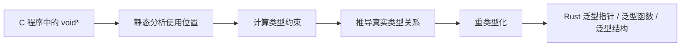

| 项目   | 内容                  |
| ---- | ------------------- |
| 会议主题 | Rust语言特性与代码翻译技术路线研讨 |
| 整理内容 | 会议纪要、总结问题回答、逐字发言稿   |
|      |                     |

---

## 一、会议纪要
会议主题：Rust语言特性与代码翻译技术路线研讨

会议重点讨论了Rust作为中间语言的编译期安全优势及内存管理机制，明确了异构语言互译的技术路线，并制定了函数级与仓库级代码翻译的验证方案。


---
一、Rust语言特性与安全机制
针对Rust的所有权系统、并发模型及C/C++到Rust的翻译策略，团队进行了详细探讨：
1. 关键进展
Rust内存安全优势：Rust通过所有权系统和借用检查器，在编译期消除了use after free、double free、悬垂指针和数据竞争等常见内存安全问题。
safe与unsafe模式：Rust通过`safe`和`unsafe`关键字区分代码安全性，`safe`模式下编译器会强制执行严格的内存安全检查，而`unsafe`允许绕过部分规则以兼容底层操作，但需程序员自行保证安全。
C到Rust翻译效果：实证数据显示，安卓系统中内存安全漏洞比例从2019年的76%下降至2023年的24%，且无新增漏洞来自Rust代码，证明了迁移至Rust的有效性。
2. 重点问题与建议
编译期与运行时安全权衡：Rust的安全保障主要依赖编译时类型系统，反向翻译至其他语言（如C）时，部分安全保障会丢失，需通过添加显式的运行时断言（assertion）来弥补。
中间表示（IR）的价值：采用Rust作为统一的中间表示（IR），可将N种源语言到M种目标语言的转换复杂度从N * M降低至N+M，大幅减少工作量。
3. 核心决策
确认研究方向：决定采用Rust作为中间枢纽，解决不同语言组件间的安全互译问题，特别是针对工业界已有不安全组件的安全化复用需求。

*** 
二、代码翻译测试与验证体系—
针对代码翻译后的正确性与安全性验证，团队分析了现有测试方法的局限，并提出了改进方向：
4. 风险与阻碍
传统测试覆盖不足：传统的行覆盖率和分支覆盖率无法有效捕捉内存模型差异和并发问题，且存在状态空间爆炸和未定义行为陷阱等问题。
形式化验证局限性：虽然形式化方法能提供理论上的语义等价证明，但对于涉及第三方库或复杂自定义对象的程序往往失效，难以应用于大规模工业场景。
5. 重点问题与建议
差分测试与变形测试：建议结合差分测试和变形测试，通过对比源程序与翻译后程序的输入输出映射关系，验证功能正确性，而非单纯追求100%的语法等价。
自动化测试用例生成：计划利用大模型或符号执行技术自动生成测试用例，重点关注边界条件和并发场景，以检测翻译过程中引入的潜在漏洞。

***

三、仓库级翻译的工程挑战
针对从函数级扩展到仓库级的代码翻译难题，团队识别了系统性工程问题：
6. 风险与阻碍
循环依赖与全局可见性：仓库级翻译面临跨文件依赖、调用图构建、宏展开等全局分析难题，C/C++的头文件机制和Rust/Java的模块系统在处理循环依赖上存在根本差异。
构建生态与工具链差异：不同语言的包管理器、构建系统及IDE配置差异巨大，导致翻译后的项目难以直接构建和运行。
7. 核心决策
分层处理策略：确立“骨架+填充”的策略，先构建整个仓库的函数调用约束骨架，再进行函数级的精细化翻译，确保接口一致性和可构建性。
---

## 二、总结问题与回答

### 问题1：Rust 安全机制所消除漏洞的具体定义、类别与后果

Rust 主要解决的是内存安全漏洞和并发安全漏洞。这类问题在 C/C++ 等语言中较为常见，原因在于开发者需要手动管理对象生命周期、指针别名、内存释放和线程同步。一旦处理不当，可能导致程序崩溃、数据破坏、任意代码执行、权限提升或远程攻击。

| 漏洞类型 | 含义 | 简单示例 | 可能后果 |
|---|---|---|---|
| Use-after-free | 内存已经释放后，程序仍继续通过旧指针或旧引用访问该内存。 | `p = malloc(...); free(p); *p = 1;` | 读取错误数据、程序崩溃、任意代码执行、权限提升。 |
| Double free | 同一块动态内存被释放两次。 | `free(p); free(p);` | 堆管理结构破坏，可能造成崩溃或被攻击者利用。 |
| 悬垂指针 | 指针或引用指向的对象已经失效，但程序仍保留该指针或引用。 | 函数返回局部变量地址，函数结束后外部继续访问。 | 访问无效内存、产生未定义行为、破坏程序状态。 |
| 越界访问 / 缓冲区溢出 | 访问或写入数组、缓冲区边界之外的内存。 | 数组长度为 10，却执行 `arr[10] = x`。 | 覆盖相邻内存、破坏控制流、远程代码执行。 |
| 数据竞争 | 多个线程并发访问同一共享数据，其中至少一个为写操作，且缺少同步约束。 | 两个线程同时执行 `counter++`，但没有锁或原子操作。 | 结果不确定、状态损坏、偶发崩溃、并发安全漏洞。 |

从机理上看，这些问题可以归为三类。第一类是生命周期错误，包括 use-after-free、double free 和悬垂指针，核心问题是对象何时有效、何时释放、释放后是否仍被访问没有受到严格约束。第二类是空间边界错误，包括缓冲区溢出和越界访问，核心问题是程序访问了不属于当前对象的内存区域。第三类是并发访问错误，典型代表是数据竞争，核心问题是多个线程对共享数据的访问顺序和互斥关系没有被清晰约束。

Rust 的所有权、借用检查和生命周期机制，正是围绕这些问题建立编译期约束：同一数据在同一时刻只能有一个可变引用，或者有多个不可变引用；引用不能超过被引用对象的生命周期；跨线程转移和共享需要满足 Send/Sync 等类型约束。因此，许多在 C/C++ 中只能在运行时暴露甚至难以复现的问题，在 Rust safe 代码中会提前被编译器拒绝。

### 问题2：关于“零成本抽象”

#### 2.1 “抽象”在编程中的具体定义

编程中的“抽象”是指隐藏底层实现细节，只暴露更高层、更稳定、更易复用的接口或模型。函数、类、接口、泛型、trait、迭代器、闭包、模块化封装等都属于抽象。抽象的意义在于降低程序理解和维护成本，使开发者可以用更接近问题域的方式表达程序逻辑。

#### 2.2 抽象成本的来源

| 成本来源 | 典型表现 | 消耗资源 | 不利影响 |
|---|---|---|---|
| 动态分派 | 虚函数、接口调用、trait object | CPU 时间、分支预测资源 | 可能阻碍内联优化，增加调用间接性。 |
| 间接访问 | 指针跳转、对象包装、引用层级增加 | CPU cache、访存时间 | 缓存局部性下降，访存延迟增加。 |
| 堆分配 | 对象装箱、动态创建对象 | 内存空间、分配/释放时间 | 增加运行时开销和内存碎片。 |
| 运行时检查 | 边界检查、类型检查、空指针检查 | CPU 时间 | 高频路径中可能影响性能。 |
| 同步机制 | 锁、原子操作、引用计数 | CPU 时间、等待时间 | 可能造成阻塞、竞争和可扩展性下降。 |
| 代码膨胀 | 泛型单态化、模板实例化 | 编译时间、二进制体积 | 编译变慢，目标文件变大。 |

#### 2.3 “零成本抽象”的含义

“零成本抽象”并不是说抽象在任何情况下都完全没有成本，而是强调两点：第一，不使用某种抽象时不为它付出成本；第二，使用某种抽象时，编译器生成的低层代码应尽量接近手写低层代码的效率。Rust 追求高级特性能够编译为与手写低层代码接近的实现，因此开发者可以使用较高层的表达方式组织程序，同时尽量避免额外运行时开销。

需要注意的是，零成本抽象并不等于所有 Rust 代码都无开销。例如 `dyn Trait` 的动态分派、`Box` 的堆分配、`Arc` 的原子引用计数、`Mutex` 的锁竞争等仍然会产生实际运行时成本。因此，“零成本”的重点在于语言和编译器尽可能把抽象开销前移到编译期，或者通过优化消除，而不是保证所有抽象都没有代价。

### 问题3：关于并发与数据竞争

#### 3.1 C、C++、Java 等传统语言如何处理数据竞争

C/C++ 一般不会在编译期自动阻止所有数据竞争。程序员需要主动使用互斥锁、条件变量、原子变量等机制约束共享变量访问。如果多个线程对同一内存位置发生冲突访问，且没有同步关系或原子操作，C/C++ 中通常会形成未定义行为。所谓未定义行为意味着程序可能看似正常运行，也可能输出错误结果、崩溃、死循环，甚至被编译器优化为难以预测的形式。它通常不会自动抛出一个稳定可捕捉的异常。

Java 提供 Java Memory Model，并提供 `synchronized`、`volatile`、`Lock`、`AtomicInteger` 等同步机制。Java 不会因为普通数据竞争自动生成同步块，也通常不会因为出现数据竞争直接抛出异常。如果程序员没有正确同步，程序可能出现可见性问题、重排序问题、丢失更新或读到旧值等异常行为。Java 对正确同步程序提供较强语义保证，但对存在数据竞争的程序只提供较弱保证。

| 语言 | 主要机制 | 发生阶段 | 数据竞争后果 |
|---|---|---|---|
| C/C++ | 主要依靠程序员显式使用锁、原子变量、条件变量等机制。 | 通常不能完全在编译期阻止。 | 数据竞争可能导致未定义行为，通常不会稳定抛异常。 |
| Java | 依靠 Java Memory Model 以及 `synchronized`、`volatile`、`Lock`、`Atomic` 等机制。 | 编译期和运行时均提供部分支持，但不会自动消除所有数据竞争。 | 通常不因数据竞争直接抛异常，可能出现可见性或更新丢失问题。 |
| Rust | 通过所有权、借用规则、Send/Sync trait、线程 API 约束跨线程转移和共享。 | 大量并发错误可在编译期被拒绝。 | safe Rust 中难以表达未同步共享可变访问。 |

#### 3.2 Rust 的 Send 和 Sync 机制

`Send` 和 `Sync` 是 Rust 并发安全体系中的两个 marker trait，用于在类型系统层面表达一个类型是否可以安全地跨线程转移或共享。

`Send` 表示某个类型的所有权可以安全地转移到另一个线程。如果一个值的类型实现了 `Send`，那么该值可以被 move 到新线程中使用。多数普通类型都可以是 `Send`，但某些非线程安全类型不是 `Send`，例如 `Rc<T>`。`Rc<T>` 使用非原子引用计数，多个线程同时修改引用计数可能造成数据竞争，因此不能安全跨线程转移。

`Sync` 表示某个类型可以安全地在多个线程之间共享引用。可以理解为：如果 `&T` 可以安全地在线程之间传递，那么 `T` 就是 `Sync`。也就是说，一个类型只有在共享不可变引用不会导致未同步内部可变状态时，才适合实现 `Sync`。

典型对比是 `Rc<T>` 与 `Arc<T>`。`Rc<T>` 适用于单线程引用计数，不具备线程安全性；`Arc<T>` 使用原子引用计数，可以用于多线程共享。若需要多线程共享可变数据，通常还要结合 `Mutex<T>`、`RwLock<T>` 或 `Atomic` 类型。由此可见，Rust 不是等到运行时发现数据竞争后再处理，而是尽量通过类型系统在编译期限制错误的共享方式。

### 问题4：cargo 中 benchmark 的含义

Cargo 是 Rust 的包管理、构建、测试和运行工具。benchmark 指“基准测试”，主要用于测量程序或函数片段的性能表现，而不是用于判断功能是否正确。它可以测量执行时间、吞吐量、迭代次数、内存行为或不同实现之间的性能差异。

可以简要理解为：

```text
cargo test   →  验证程序是否正确
cargo bench  →  测量程序性能如何
```

在代码翻译研究中，benchmark 可以用于比较源程序与翻译后程序在运行时间、内存占用、吞吐量等方面的变化，从而判断翻译是否引入显著性能退化，或者是否带来了性能优化。

### 问题5：CWE 漏洞库是什么及其用途

CWE 的全称是 Common Weakness Enumeration，中文通常译为“通用缺陷枚举”或“通用弱点枚举”。它不是某一个具体漏洞，而是对软件和硬件弱点类型的标准化分类体系。例如 use-after-free 对应 CWE-416，double free 对应 CWE-415，越界写对应 CWE-787。

CWE 的主要用途包括：第一，为漏洞类型提供统一命名，使研究人员、工具开发者和工业界能够使用同一套术语描述缺陷；第二，作为漏洞检测、安全测试和自动修复工具的分类依据；第三，作为安全工具评估和 benchmark 构建的基础；第四，在代码翻译场景中，可用于评价翻译过程是否消除了源程序中的已知弱点类型。

需要区分 CWE 和 CVE。CWE 是“漏洞类型”或“弱点类别”，例如“use-after-free”；CVE 是某个具体产品或软件版本中的具体漏洞实例。对于本研究方向而言，CWE 更适合作为安全属性分类和测试用例设计依据，CVE 则更适合作为真实漏洞案例来源。

### 问题6：代码翻译中的测试与验证

#### 6.1 如何用测试判断翻译后代码是否会因底层差异造成灾难性后果

代码翻译的测试不能只关注行覆盖率或分支覆盖率，因为跨语言翻译的错误往往来自内存模型、异常机制、并发模型、数值表示、库函数语义和对象生命周期等底层差异。即使源程序和目标程序执行了相同分支，也可能因为边界值、对象状态、线程调度或异常路径不同而产生严重后果。

因此，可以建立分层测试体系。第一层是功能等价测试，即对同一组输入分别运行源程序和目标程序，比较输出是否一致。第二层是差分测试，即以源程序或已验证实现作为 oracle，检测翻译程序在相同输入下是否偏离预期行为。第三层是变形测试，即在没有明确 oracle 时，构造输入之间的关系，例如排序结果与输入排列顺序无关、数值函数满足单调性或等价变换关系。第四层是安全属性测试，专门构造越界访问、空指针、释放后访问、重复释放、异常路径和并发调度等测试场景。第五层是动态检测工具辅助，例如在 C/C++ 侧使用 AddressSanitizer、ThreadSanitizer、UndefinedBehaviorSanitizer 等工具，在 Rust 侧结合编译器检查、Miri、Clippy 和测试框架，在 Java 侧结合异常监控、并发测试与运行时断言。

测试能做到的是发现错误、提高置信度和定位反例，但不能证明程序完全没有错误。原因在于输入空间、程序状态空间和线程调度空间通常极大，测试用例只能覆盖有限样本。因此，测试应与静态分析、形式化验证、运行时断言和安全规则检查结合使用。对于第三方库、自定义对象、复杂系统交互较多的程序，形式化验证往往难以全面适用，测试仍然是最具通用性的工程手段。

#### 6.2 自动生成测试用例与传统测试的不同

传统测试通常从需求规格说明书出发，先明确程序应该做什么，再设计输入、预期输出和覆盖目标。代码翻译场景则通常从已有源代码出发，源程序本身往往可以作为 oracle。也就是说，不一定存在完整规格说明书，测试系统可以先运行源程序获得输入输出映射，再用同一输入运行翻译后的目标程序，比较关键行为是否一致。

| 维度 | 传统测试 | 代码翻译测试 |
|---|---|---|
| oracle 来源 | 规格说明书、人工预期结果 | 源程序运行结果、源程序中间状态、变形关系 |
| 测试对象 | 单语言程序 | 源语言程序与目标语言程序 |
| 主要目标 | 判断程序是否满足需求 | 判断翻译是否保持关键行为并避免引入新风险 |
| 关键难点 | 业务路径覆盖与预期结果定义 | 跨语言输入构造、输出对齐、异常映射、库函数 mock、对象序列化 |
| 特殊问题 | 规格可能不完整 | 源程序本身可能含有未定义行为或安全漏洞，不能盲目视为正确行为 |

#### 6.3 代码翻译测试目标是否应区别于传统测试

应当区别于传统测试。代码翻译不应简单追求逐语句等价或所有行为完全一致，而应关注“定义良好行为保持一致、不安全行为被拒绝或修复、关键安全属性不得退化、性能和资源开销可量化评估”。

例如，源 C 程序数组越界时继续写内存，翻译后的 Rust 程序触发 panic 或返回错误，这种行为差异不应简单视为翻译错误，而应视为安全增强。源程序存在空指针解引用风险，目标程序增加 `Option`、判空或断言，也属于安全化改写。源程序在数据竞争条件下结果不稳定，目标程序通过 `Mutex`、`Atomic` 或所有权约束使结果稳定，也属于并发语义加固。

可以进一步设计以下评价指标：

| 评价指标 | 含义 |
|---|---|
| 功能通过率 | 定义良好输入下，目标程序与源程序输出一致的比例。 |
| 差分不一致率 | 源程序与目标程序在同一输入上的行为差异比例。 |
| 安全违规率 | 是否出现越界、use-after-free、double free、数据竞争等问题。 |
| CWE 消除数量 | 翻译后消除了多少源程序中的 CWE 类弱点。 |
| 运行时异常率 | 是否引入新的 panic、exception、crash。 |
| 性能变化率 | 运行时间、内存占用、吞吐量等指标的变化。 |
| 可构建率 / 可测试率 | 翻译后的项目是否能够完整构建、运行测试并集成到目标生态。 |

### 问题7：仓库级翻译的难点和痛点

函数级翻译主要关注单个函数的输入输出语义是否一致，而仓库级翻译关注整个工程能否在目标语言技术栈中构建、链接、运行、测试，并保持对外行为一致。仓库级翻译的难点不只是“函数更多”，而是从局部语义问题升级为系统工程问题。

| 难点 | 说明 |
|---|---|
| 跨文件依赖 | 函数、类型、全局变量、宏定义可能分布在多个文件中，必须先分析依赖关系。 |
| 头文件与宏 | C/C++ 的 `include`、宏展开、条件编译在 Rust/Java 中没有直接等价物。 |
| 调用图与类型图 | 单个函数翻译正确，不代表函数之间的参数、返回值、生命周期和错误处理能够匹配。 |
| 构建系统差异 | Makefile、CMake、Cargo、Maven、Gradle、npm 等生态差异较大。 |
| 第三方库映射 | 源语言库可能没有目标语言等价库，需要桥接、重写或替换。 |
| 命名空间与可见性 | C、C++、Rust、Java 的模块、包、命名空间和访问控制机制不同。 |
| 链接与 ABI | 静态库、动态库、符号导出、FFI、调用约定都会影响最终运行。 |
| 全局状态与初始化顺序 | 全局变量、单例对象、静态初始化顺序在不同语言中可能不同。 |
| 并发模型差异 | 线程、锁、原子变量、内存模型差异可能导致集成后行为变化。 |
| 测试迁移 | 原项目测试框架可能无法直接迁移，需要重建测试入口、mock 和依赖环境。 |

仓库级翻译确实可能产生函数级翻译中不会出现的新问题。即使每个函数单独翻译都正确，集成后仍可能因为接口不一致、模块命名冲突、依赖顺序变化、全局状态初始化差异或库函数替换不当而失败。例如，一个函数的返回值从裸指针翻译为 `Option<T>`，但调用方没有同步修改，就会造成接口不一致；两个文件原本通过头文件共享宏常量，翻译后一个模块使用新常量，另一个模块仍使用旧值，则可能导致系统行为偏移；源项目依赖某种全局变量初始化顺序，翻译后模块加载顺序变化，也可能引发运行时错误。

因此，仓库级翻译更合理的路线是“骨架+填充”。首先构建仓库骨架，提取文件依赖、模块关系、调用图、类型图、公共 API 和构建入口；其次建立跨语言映射规则，统一类型映射、错误处理映射、内存管理映射、库函数映射和可见性映射；再次在骨架约束下进行函数级翻译，使每个函数的名称、参数、返回值和调用关系服从系统级约束；最后进行仓库级构建、差分测试、安全测试和基于反馈的迭代修复。

一句话概括：函数级翻译解决“代码片段能不能翻对”，仓库级翻译解决“整个系统能不能翻完、构建起来、跑起来，并且关键行为和安全属性不出问题”。

## 四、逐字发言稿
说话人01(00:00:00): 录制？我自己，我也录一下行，那咱们就从头开始看一下。

说话人01(00:00:11): 这个方向一是开源开发框架及融合技术站。所谓框架主要是将 java python C 加加等异构语言翻译成统一中间语言，比如说 rust 将异构语言程序翻译成 rust 有两个好处。第1rust 是大家都关注的语言，这里是用 rust 替代其他语言。有什么好处？

说话人01(00:00:32): 这里是您提的一个问题，我直接看下边，就是为什么要选 rust 作为统一中间语言 rust 当前的首先关注度当然确实是很受关注。

说话人02(00:00:44): 上面那一段是我问的问题，底下是大模型的回答，咱们直接看下面就行了。

说话人03(00:00:48): 大模型的回答对咱们不是？

说话人01(00:00:52): 对我。我刚刚看过了 rust 其实现在华为那边包括我看最开始是美国对他们安，就是美国国防部提出来的，就想把操作系统本来是由 C 加加写的嘛，转成 rust 肯定 rust 在语法层面上是一个安全的内存安全的语言，然后它确实有很多的领域。比如操作系统上有用，这种区块链什么的。

说话人02(00:01:20): 杨老师这样我就插一句，美国的 darpa 基本上是高校老师做科研的风向标，就是最下面这一个。如果我们的研究 darpa 也关注，就证明咱们做的在道上了。做这样的研究会有意义，他们也说24年我觉得是个重点，就是 C 到。

说话人01(00:01:48): 对确实 CTO rust 大概确实是24年的时候开始有国内，国外都有这个需求，然后软工这边的论文也是出来了。一定数量，不能说非常多，因为代码翻译整个代码行业进入大模型的时代，也是从二三年开始。

说话人02(00:02:07): 一般在高校里。

说话人01(00:02:08): 所以是时间不长。

说话人02(00:02:10): 杨老师您也是要关注这个 darpa，它是个风向标，而且好多的老师都以它都看他们怎么做，咱们以后就得持续关注。

说话人01(00:02:15): 行。

说话人02(00:02:25): OK 杨老师您继续！

说话人01(00:02:28): 这样，然后下面这有一系列的应用领域我就直接过了。

说话人01(00:02:39): 然后接着是 rust 相对于其他语言的核心优势。第一个是所有权和禁用检查它编译期消除 user for free，然后 double free 悬挂悬垂指针数据竞争等。其实我之前也了解过 rust 就是说它的引用好像只能是一个对某一个地址的引用只能是一个就只能有一个别名去。所有权它就可以去控制某一个地址，它只有一个别名去引用它，那这是从语法层面上去约束。如果说你有多个别名的话，它会报错，然后这个就叫所有权，然后无 gc 的确定性内存管理。

说话人02(00:03:25): 杨老师，那我想问个问题，就是他在编译的时候就想消除的，他后面说的什么 user 那个 use after free double free，这些东西的地位在哪？什么悬垂指针，悬挂指针，数据竞争，这些都是叫什么？都是什么相关的概念？

说话人01(00:03:52): 跟内个内存。你比如说某某一个变量，它有多个别名，但是这些别名都可以操作它的地址。那如果某一个别名它把这个地址上的数据释放了，但是其他的别名你还可以去在代码中使用的话，这不就形成了悬垂指针了吗？这个是在其他语言中都是存在的。你就比如说 C 加加用的是指针去？java 里面有别名，就类似，它们都会产生某一个指针对变量，它把它的地址给释放。你另外一个指针也指向它，你还可以去用它这样一用的话就直接导致悬垂指针。所有权的话它要求只有一个变量。

说话人02(00:04:43): 它消除的这些是潜在的叫潜在的代码漏洞？

说话人01(00:04:51): 对吗？对！

说话人02(00:04:52): 对！

说话人01(00:04:53): 对他的方法把语法变得更加的严格。

说话人02(00:04:58): 所以他关注的还是代码漏洞的问题，就是这些东西可能是会被人利用的，利用这进行攻击等等的，然后把它给消除掉。

说话人02(00:05:13): 数据竞争他？

说话人01(00:05:15): 我觉得也是同一个概念，就是多个别名引用同一个数据。

说话人02(00:05:22): OK！

说话人01(00:05:25): 那如果说的不对的话，同学们请多多这个你们指指出来，因为我了解 rust 是很久之前。

说话人02(00:05:30): 没有不是让并不是他们不是杨老师是这样，不是让他们指出来，而是说让他们去查。我觉得这些地方，我们把我的问题，同学们记一下，第一个就是这个 use after free1直到怎么 double free 到数据竞争每一条具体是什么？它是什么意思？举一个例子，最后是把它们都归为一类，这一类这些可能是代码的缺陷或者是代码的漏洞。这些代码漏洞每一个都会导致什么样的后果，什么样的灾难性的问题，把这成体系的总结一下，也可以用大模型再去问，但是要把握正确性？这是第一个问题，杨老师您继续。

说话人01(00:06:29): 后面这个是无 gc 确定性内存管理，这个我就不太了解是啥了。然后咱们再往下看看，可能要查一下。

说话人02(00:06:42): 再往下看看，可能要查一下这个 G3。

说话人01(00:06:45): 这些就是垃圾回收垃圾收集 garbage collection 就是可能跟垃圾回收相关的机制有不同。

说话人03(00:06:52): 扔垃圾回收。

说话人02(00:06:54): 有垃圾回收的内存如何管理？

说话人01(00:06:57): 管理？可能看 rust 还是怎么管理的管理垃圾内存？

说话人02(00:07:01): 他这些什么 ra 加 job 什么 wttw 这个 sww stw，这些都这些技术都查清楚就 OK 了。下次就由同学作为主体给我们讲一和二的两个问题展开讲。

说话人01(00:07:26): 后面这可能就是它多态的形式，好像在多态上确实也跟其他的面向对象有一些差别，我也得查一下。

说话人02(00:07:38): 零零成本的抽象是什么？首先抽象是什么？让同学查咱们也得给他先掰开了一些，让他们知道都有哪些问题。

说话人02(00:07:56): 抽象是什么东西？在程序。

说话人01(00:07:59): 工装跟抽象面向对象里的概念，我觉得也是一样的，就是把怎么说封装把函数？写把那些实现写到实例函数里面，然后再封装到类里面。抽象这个过程其实也是抽象吧，我觉得。

说话人02(00:08:21): 把函数封装成类，能够复用就是抽象？把功能抽象成对象，把函数抽象成对象抽象，那么抽象的成本来源于哪？抽象的成本来源于哪几个方面，每一个方面它都消耗什么资源，那么如那么这个成本它对于软件？说对于什么东西会形成一个不利的因素或者是代价，零成本就有什么样的意义？零成本能带来什么好处？它最大的优势在哪里？这是我们想知道的问题，各位同学记一下。让大模型就在大模型的配合下，给出来一个比较靠谱的答案要求证，这第三个问题，这第三系列问题。然后咱们这样就是每个同学把这些问题就我们杨老师问这个问题，大家先都列出来，这个就是 prop 就这个叫什么？question，然后接下来再给个 response 以这种格式下次去讲，然后如果需要配图的话，我希望大家多用图来表达。然后配画一张草图贴在上面，或者是在哪找这么一张图，能给大家把这个问题们能讲清楚，我们问的这一系列的这个问题，也希望你的答案，也是一条一条的能对上行杨老师咱们继续。

说话人01(00:10:25): 然后后面就是并发，通过 send 跟 think 两个 market tree 在编译器阻止数据竞争。并发的差距差别，我也没有了解过并发的差别是什么？

说话人02(00:10:50): 这个 C 和 C就是 C 和 java 也 C 都不具备阻止数据竞争的能力。所以这个数据竞争这个事儿，它有可能会导致死锁，就是导致这个程序运行的时候崩溃等等的，这可能都不是漏洞的，就是包括上面这些什么悬垂指针？you use after free 等等的可能也会导致这个程序它在运行的时候会崩溃。它为了保证安全。他提出来一些这个同步发发送，这样的一些机制来规避数据竞争。在原来的 C java 当中可能不具备这个能力。

说话人02(00:11:43): 在这一块我想问两个问题。第一个问题就是 C 和 C 加加以 java 如何来处理数据竞争？不在编译的时候做。那他在什么阶段去规避数据竞争或者阻止数据竞争，能够规避，那么你给出来机制，如果不能规避。那么我们就说不能规避，那么它是如何来，比如说会不会抛出异常等等的就是怎么去处理这种数数据竞争的情况的，会遇到数据竞争怎么办？第一个问题，传统的这些程序语言。第二个就是这个 rust，这个 rust，它提出来的 send 和 synchronized 的这样的一个机制，把这个机制的详细原理搞清楚。OK。

说话人02(00:12:42): 后面。

说话人01(00:12:42): 后面就是它的一个工具，用来去做编译的编译，运行的就是反正写这个 javascript 程序的话，会用 cargo 这个命令去执行。

说话人02(00:13:00): 命令行！

说话人01(00:13:00): 就像 java java C，命令行的一个一行执行这个 rust 源码的一个命令，让它跑起来。

说话人02(00:13:11): 他就能够从包管理到构建到测试文档和基准，这个基准就是 benchmark 是吗？什么意思？就都出来了？

说话人01(00:13:23): 这个我不太清楚，说执行的时候会用到 cargo 这个命令，就好像比如说我们写 node js 的代码会用一个 node，然后文件名去让这个文件跑起来。

说话人01(00:13:35): 或者是什么前端那些是不是也会用用什么来？反正各反正就是比如说 python 嘛 python 第二什么文件类似。

说话人02(00:13:51): OK 也是加了 C 等等的可能是编译的这么一个指令了？后面括号里的我也不太懂是啥？

说话人01(00:14:06): 就是 rust 的一些特性。它其实也没有说完整，还有一些它不是有 safe 跟 unsafe 的那种标志吗？这些特性它都是写在 safe 的这种标志符下面就告诉显示的告诉程序员，这段代码你不需要考虑我上面说的这些风险，然后它也可以用 unsafe 去标记部分代码。这些代码就是它不需要遵守这些要求，不需要做这些要求，也就是说这些代码是有可能会出现以上这些风险，但是编译器允许它通过编译。

说话人02(00:14:48): 这个 safe 和 answer 是 rust 里面的关键字？

说话人01(00:14:53): 标志一下，说它是否严格遵循 rust 的 safe 的标准。要求一定要遵循 safe 标准的话，它的编译器会按照标准去检查。unsafe 的那些就不会按照标准去检查。为什么会要有 unsafe 跟 safe？是因为如果我们用 safe 去标记的话，它会给这个代码的编写增加了很多，就很多的功能是不能用的。比如说 C 为什么能跟底层去交互的，那么自如？因为它是内存不安全，就是它对内存操纵是的，可操作空间更大。所以说 rust 为了避免说让它失去对那底层的更大的一个主动权，它就提供了 unsafe 这个标志就允许它去像 C 那样去控制各种各样的内存。

说话人02(00:15:53): 那我能不能这么理解，就是这段代码，如果标注的是 safe，它的底层实现机制和标注是 unsafe 的底层实现机制是不一样的。

说话人01(00:16:05): 我感觉在编译层面加了一些约束，它实际上都能做到。如果说你加了 safe 的话，我这个检查会更严格，你就有一些你可做。我不让你做你标记了 unsafe 的话，我就不会去检查了，你就所有的事都可以做。

说话人02(00:16:23): 我考虑是同样的一段代码。这个代码在转成就在编译这个层面就是转成中间代码的这个过程都是一样的，在底层实现的时候，就真正的去在后端去运行了，可能这个 safe 和 unsafe 的机制是不一样的。

说话人01(00:16:49): 也许是这样吗？

说话人02(00:16:51): 在语语义分析的时候，底层语义实现这个阶段。词法和语法分析都一样，就是到底层语义的时候就赋予它底层执行的语义了时候就不一样了，就有可能会出现 safe 的情况。那你的程序就会报错，就让你去修改，因为它不安全？或者是说我底层我去做那个什么无 gc 的确定性内存管理，这些可能有很多的实现机制，都是对 safe 是和 unsafe 是不一样的。所以。

说话人01(00:17:32): 所以。

说话人02(00:17:33): 这个形式化基础叫什么？rust belt 就是个安全带，叫机械化证明类型系统的可靠性。

说话人02(00:17:46): 类型系统指什么？

说话人01(00:17:50): 类型系统它里面的类型，各种数据类型。

说话人02(00:17:57): 那类型系统的可靠性是怎么理解？

说话人01(00:18:03): 我也不是很懂这句话，啥意思可以搜一搜？

说话人02(00:18:10): 对是大家记一下这个地方类型系统可靠性怎么理解。具体怎么证明的，不就不要求大家去深挖了，杨老师我们继续。

说话人01(00:18:29): Rust 与异构语言的互操作性。就是 rust 它是有一些工具能够直接去操作 C 语言跟 C 加加，然后你可以看到，那其他语言也有一般这种互操作性都需要相关的工具去实现或调节。这里就给了一些例子。比如说我要调用一个 C 代码的话，就是 extern C 有这么一个关键词 extern 这么一个关键词，然后双引号 C，然后后面这个我不知道是啥，可能是相关的代码吧。

说话人02(00:19:10): 所以这块儿它是有这些桥接技术的，就和 roost 相连。

说话人01(00:19:13): 对。

说话人02(00:19:15): 您之前说的，如果有些库重载的库特别大的话，我们就没必要去翻译它用桥接用 roost 也可以实现？OK。

说话人01(00:19:33): 然后其他的也是他跟其他语言的调节。使得 rust 为枢纽完成它们之间互译成为现实工程路径，而不必一次性重写。

说话人02(00:19:49): 所以这个都是和 rust 进行桥接的，都可以做上面列表里的。

说话人01(00:19:55): 上面列表格里的哈。然后就翻译为。

说话人02(00:20:03): 我们能用吗？因为他有些我看他写的什么微软内部。

说话人01(00:20:10): 具体要去看看这些工具是不是他编的，或者是怎么用，如果是正确的话。

说话人02(00:20:17): 反正应该会能商用？

说话人01(00:20:20): 反正 gni 我是查过是。就是它会它有一些写法的规则就是按照它库的要求去写一个现成的 c 的库。我们需要在 java 这边去写一些代码，然后去把相关的功能调用起来，然后通过它就可以桥接一个已经存在的 C 程序。

说话人02(00:20:52): 我发现我觉得这个技术路线就很可行了。

说话人01(00:20:52): 我觉得。

说话人02(00:20:57): 把它转成 roast？然后再翻译成 roast 不同语言的，如果说有一些重载的仓库的话，我们也可以用桥用 roast 去做桥接这条路线没啥问题。

说话人01(00:21:18): 翻译为 rust 的安全性收益。别的语言它可能会存在一些问题，刚刚说的这些问题缓存缓冲区溢出 use after free 然后 double free 包括其他的各种问题。然后 rust 这边是在编译层面是会做检查的，所以说编译的时候就能暴露出这些问题，然后暴露出来的话，程序员就可以做相应的修改。

说话人02(00:21:46): Cwe 是什么东西？

说话人01(00:21:49): 一个漏洞库。我搜一下它全称好像是美国的一个漏洞库，就是他们一般发现漏洞之后就会去 cwe 里面去认证一个序号，然后以后跟这个漏洞相关的，他就用这个序号来标记。

说话人02(00:22:06): 我们根据这个漏洞库去测试 rust 看看 rust 里面有没有这种漏洞？

说话人01(00:22:17): 反正是这些漏洞都是别的语言已经发现了，它就会得到一个编号。你只要发现类似的漏洞，都可以在这个库中找到例子，它就是这么个作用。我搜了一下，叫 common weakness in immuration 就是公共弱点。枚举是由社区共同维护的关于软件和硬件安全弱点的分类列表。然后我记得好像是美国的哪个部门去维护？美国网络安全与基础设施安全局去维护的。

说话人02(00:22:54): 它肯定是要有些用？我可以用库来干嘛？来做测试，它相当于是个 benchmark 集。

说话人01(00:23:09): 有点像是个 benchmark，他们可能会从里面挖一些数据，然后做出来去做推理，看看效果怎么样。

说话人01(00:23:19): 另外就是他们有一些做安全的，如果挖到了一些漏洞的话，会去跟 cw1e 里面去对比一下，然后如果说不存在他们的找到新发现的这个漏洞的话，他就可以去里面获得一个编号。就相当于开源了，大家一起贡献。

说话人02(00:23:37): 所以，我们可以根据这些库已经发现的这些漏洞，然后去检查先这个 rust 或者其他的语语语言里面有没有这方面的漏洞？

说话人01(00:23:56): 这里就体现了一下 rust 相较于其他三种语言在安全性上的优势，就这些漏洞它都不会犯，因为它有相应的语法检查。

说话人02(00:24:10): 所以他是把这些主流的漏洞的类别也都写上了，那么就是做这一块就是为什么列这块？我是想，我们把一个一种代码。不是说原封不动的翻译成 rust 的这个代码，而是说在翻译的过程当中，还要对源代码进行一个优化和提升安全性的提升？那么这个表现在就是源代我们翻译之后的代码和源代码，它的运行为可以不完全一致，但是一定要把这个行为往好的地方去引导。比原来的运行为更安全，更高效，这样的翻译是受欢迎的？同时，保证功能的正确性。

说话人02(00:25:07): 所以我今天也翻翻了翻编译原理的书，它上面也是说的。现在的编译器都是有前端终端和后端终端就是负责做一些终端第一个作用就是把这个要生成中间代码。第二个作用就是它要做和目标，就是和这个目标机器还有这个源语言无关的就是独立于这些的那些通用的优化方法，就是在中间代码上去做通用的优化，它跟你的原语言无关。跟你到最后用在哪个机器上也无关，现在都是做这种分工，咱们的工作就可以参考现代编译器的这个雏形，这个架构，这种编就现在编辑这个前中后端的这种软件架构来做。同时在这个代码翻译的时候，正好把这些个漏洞反正都有的，把这些漏洞再一检查。我这个代码通过了测试，没有这些漏洞，或者一旦有我怎么给它做优化做修改，我想是这么个逻辑。

说话人01(00:26:31): 我实证数据说，安卓内存安全漏洞从2019年的76%下降到24% 2023年。安卓中无任何新的内存安全漏洞来自 rust 代码就说明它可能把安卓中的安卓操作系统的部分代码就迁移到 rust 上。然后 cloudflare ping 三年生产环生产环境，零内存安全事件。microsoft 用 rust 重写字体，GDI 模块相关漏洞类别在新代码中归零，就是说用了 rust 的时候，很多软件它都迁移到 rust 上了，然后它们的一些漏洞也就相应的就消消除了。

说话人02(00:27:18): 还真是我觉得这个 rust 在几年之前，我们去就是 china soft 去开会好好多的工工业界的人都是说劝我们做这一块做 rust。我觉得这个方案挺对的，就朝这边做了您之前接触的那个华为是推这个 rust 是哪个组？

说话人01(00:27:50): 他们挺早的，我当时想叫揭榜一个难题来着。然后但是人家南京大学那边已经在做了，可能得小一年了，所以我可能得24年或甚至更早一点，他们就在想要搞这个 CTO rust 的翻译。

说话人02(00:28:14): 差不多，我应该更早。2223年那个时候还是做自动驾驶的公司跟我说，因为他们要注最最注重这个安全。

说话人01(00:28:31): 我当时主要是学生太少，所以我就没有去直接转到 CTO rust，就是还是先以发文章的这个目标去做这个 C 加加 python java 这些比较熟悉的语言之间的翻译。

说话人02(00:28:44): 那你要做这块你就更容易发文章，因为。

说话人01(00:28:47): 对，但是 rust 是新语言嘛，还有学习成本。

说话人02(00:28:48): 往 rust 上去做是更容易被接收的。

说话人01(00:28:56): 对他这个动机会更强一些。

说话人02(00:28:59): 你无论做到什么样。

说话人02(00:29:01): 是你是第一个做这样的工作是更容易做个人。

说话人01(00:29:06): 个人。

说话人02(00:29:07): 做什么 C 加加你是不是要跟他当前最第一的比？

说话人01(00:29:13): 我觉得动机也弱一些，就我感觉之前我做的时候。

说话人02(00:29:19): 之前我做的时候是这样 OK 杨老师咱们继续这样就没关系，这我这边的这几位同学咱们一块儿做。

说话人03(00:29:31): 我等会叫我们一个研究生也做一下这块儿。

说话人02(00:29:35): 让他。

说话人03(00:29:35): 让大家跟他一块闹一下。

说话人01(00:29:38): 双向通过 rust 互译能否同时修复安全问题可以需谨慎。我大概看了一下它这个地方就跟我当时说的比较像，就是正向的话，各种语言到 rust 的翻译，可以借助静态分析推断所有权生命周期借用关系。这就是构造一些元数据，把这些元数据抽出来，然后用 rust 的类型系统自动重写原本不安全的指针，访问未初始化数据竞争模式，可以获得翻译及修复。它这个地方翻译及修复是因为 rust 的语法上它能够保证安全，就是它在它用某一些语法规则是这三种语言都不没有的。这三种语言它不安全，但是 rust 有这种语法，它按照这种语法去把相关的功能重写一下它翻译了之后自然而然就是安全的。

说话人01(00:30:37): 反向的话是 rust 到其他语言保持安全 rust 的安全保障大多来自类型系统，而非运行时？我刚刚说它是在编译的时候保证的安全，那么反向翻译时部分保证会丢失，为什么会丢失？因为这些语言它不存在相关的语法规则，它在编译的时候是不可能保证安全的。但若仅翻译已修复的模式，如把多余的边界检查和 opinion 检查保留在目标语言的显示判空边界判断中是可以的。然后，虽然这些语言它在语法上没有相关的安全的保护，但是我们可以写一些显示的判断。你比如说，我就要求。每一个对象它只有一个别名，或者说它不存在别名。我只能通过它对象名去。调用它，那么我就每次都会判断一下我写的时候我就不让它去写别名？它肯定就不可能出现。double free 的问题，或者是悬垂直针的问题。我只要把这个对象删了，就删了，也没有其他的别名可以调用它。

说话人01(00:32:01): 另外就是比如说边界判显示判空边界判断，就是 rust 它有数组的越界自动的检查。但是 C 没有嘛 C 的话，我们可以不断的给它增加数组的元素，但是它超界的时候就会在运行时报错。我们就可以在写 C 的时候给它加一个 if 判断，要求它如果超出的话，你就不能再去写，不能再往上加了，或者是要求它。总之就加一些显示的判断条件去保证运行的时候，只要这个数组的给定的数量超出它的容量的话，就不能再写入了。

说话人01(00:32:48): 这个地方第一条是我是这样理解的。然后第二条是把 rust 的所有权迁移翻译为目标语言中的这个什么 own 的什么什么什么东西，我也不想知道，我也不知道他说的是啥。所有权迁移翻译为目标语言中的 unique ptr 是不是唯一的指针？ptr 是指针？那唯一的指针，我觉得就是像我刚刚说的就只有一个指针可以指向一个内存，你不能有多个指针指向同一个内存。这样的话肯定是保证我不会出现内存泄露了，就是不能说那些就是 double free 重重复重复释放，内存是不可能，因为只有一个质量，我只能释放一次。后面这个 own 的我也不知道我不知道是啥，try with resources 是不是 try catch 相关的东西？就可以回去，咱们可以回去再看一下。

说话人01(00:33:58): 在目标语言中添加运行时断言代替编译时检查则绝大多数被修复的运行时缺陷可以保持。就是写那种 assertion，我的感觉。反正他就是通在目标语言的基础上，尽量的通过主动的去写一些语句去保障它的安全。来维持 rust 中的这些安全。

说话人01(00:34:37): 它这个断言代替编译时检查的话，这个断言肯定是要运行的，是运行时断言，也就是运行到了 ztion 的时候。我们可能要有个有提示，说是报什么错，通过 zertion 去报错，然后代替编译式检查。有一些错误还是不能在编译的时候给它检查出来。语言它没有相应的语法编译器也不会去检查相关的这些错误。所以我们只能通过这第三条，这就添加运行时断言来去检查错误。然后但如 rust 的并发安全翻译到无类型保证的目标语言是只能转化为编程约定加运行时检查不再具备静态保证。可能在并发这块上，我们也不能在编译时查出错误来，必须是运行时才能发现错误。我觉得语言特性决定的就是其他的语言，它都没有 rust 这些复杂的语法去在编译时给它检查出错误来。我们就要显示的去写出来，写出那些约约束显示的，把约束写出来，要考虑怎么写。然后以 rust 为中间表示的互译框架是单向加固，加双向同步的最佳枢纽。加固在 rust 端做目标语言端受通过受限模式翻译，尽量保留，就是通过受限的模式来反应，尽量保留它的安全性。

说话人02(00:36:29): 杨老师就是我觉得这个地方是我们能最先做起来的一个点，我说咱们整个的架构和体系同样重要，就是能让学生做下去的一个点。可能在就是我们首先我们要解决的问题是什么，我们要解决的问题比如说 C 加加和 java 之间的互译，然后正好是来源于像潍柴这样的需求，它是需要不同的。用不同语言的组之间要进行合作，要进行协作，或者说已经有 C 的 C 语言的组，比如说写了一个组件 java 那边要用。现在是这么个问题，当然你可以通过桥接的这个方式，但是桥接主要又带来什么什么什么样的问题。把这些问题一说。那么现在有一个方案，就是要把他们就是要把这个 C 的转译成就 C 的这个组件转直接转译成 java 这个组件进行无缝的这个衔接。在转移的这个过程当中存在的一个挑战是就是你转过来可能不安全。c 转成 java 它不安全。不安全，有可能有很多的漏洞，因为它们之间底层实现的机制不一致，会造成灾难性的后果。我们可以列几个底层的漏洞都有哪些？造成灾难性的后果有多严重，这是我在讲 introduction。

说话人02(00:38:07): 讲完这些之后再说我们提出来一个基于 uir 的方法，具体就是 uir 就是 roust。第一步，把比如说把 a 语言转换成 rost 转成这个语言。这个转 root 语言，它会自动的去重构，就重构成安全的，然后再把 rost 语言这种安全的语法。您说的再去转成 B 语言的时候，可能会有一些安全的漏洞。我们采用了几大措施，把漏洞给它补齐给它弥补上。对于甚至是对于实在没办法处理的漏洞，我们也能对它的副作用进行预测以及在运行时的可控。

说话人02(00:39:00): 基本上这个小点我觉得可以，现在就可以去做，你说？

说话人01(00:39:11): 曾老师，我一直有个问题，首先一个 X 语言它转到 rust，为了我们是为了安全。转到 rust 上。但是某一个 X 语言，它不具备 rust 的那些语法的特性。它，那么它这个 rust 当然 X 都转了 rust 是 OK 的。rust 转到 Y，这个 Y 它也不具备语法的特性，它是需要通过显示的。语句去以妥协的方式完成 rust 相关那些安全的检查。Y 的特性跟 X 是一样的。如果我们想让 X 安全的话，x 也需要显示的语法不语显示的那些语句去保障它的安全。那 Y 也需要。那为什么不直接把 X 转到 Y？它俩是一个对等的。

说话人02(00:40:05): 直接转到 Y 的话，是不是在方法论上，你是需要具体问题具体分析？

说话人01(00:40:13): 你想我这一系列的网。

说话人02(00:40:18): 编译器的前后端要分离的原理就是我们编译器。比如说我现在有一个终端，这个终端就负责把一种语言一种怎么说？说就是编译器分前端和后端。前端，比如说你有1010种语言，后端，这个目标语言也有10种。你要是让它每一个 X 和每一个 Y 都要去设计一种转换模式的话，那就是10×10就100种，但是你要是中间有个 rost，你只需要做20种就 OK 了。前前前端的这10种和 roust 进行转换。我设计我来写10个转换程序。这个 roust 和后端，比如说和什么英特尔的和什么等等等的这些不同的硬件的语言。然后那么我就写后端的转换，写10种就可以。然后您说那种方法直接从 ax 到 Y 可以它解决这一个问题可以，但是它不就是它并不经济，所以我觉得这个问题还是可以回答。

说话人01(00:41:37): 我觉得这个确实我们需要一个中间的表示，作为中转，这样确实可以减少很多的工作量。

说话人02(00:41:43): 它就是10+10，它不是10×10。

说话人01(00:41:46): 对。但是有个问题是，你想把 X 这个语言翻译到 rust，它中间是否它中间也有很多的过程？那你想首先我们要得到一个完全正确的 rust，它在转到 Y 的时候，它还我们都难以保证它的正确性。

说话人01(00:42:03): 这个错误会迁移很大，我觉得中间表示最好是一个基于规则得到的就它一定是正确的。

说话人02(00:42:12): 是这样，就是转成 rust，从 a 转成 rust 的话，它是否已经有很多的研究，然后在 rust 这个层级会有一些重构。

说话人01(00:42:27): 目前 C 到 rust 研究还是挺初期的，就是效果都不好，因为它都是仓库级别的难度跟难度不会比 C 到 java 要容易。

说话人02(00:42:37): 我们不去研究仓库级别，我们可以从函数级别的开始研究起仓库级别就是我后面讲的另外一个问题。仓库级别它不再是仅仅是编译器的工作了，它是有预处理。还有汇编器，还有这个链接器等等的这一整套的一个流程下来，它不是编译器的工作相对固定好解决，就是函数级是编译器的工作。然后如果一个函数或多个函数组成的，你说的那个仓库，它是后面很多都是链接器的工作，到现在基于规则的可能不能很好的来 cover 住吧。咱们可以从简单到复杂一点点的去解决这个问题。

说话人01(00:43:32): 如果是函数级别的话，python 到 C 加加这些目前已经解决了，就是大模型，单纯大模型独立的去翻已经翻的很好了。

说话人02(00:43:42): 他可能做不到很安全？

说话人01(00:43:46): 安全的话。你把 java 写的很安全，通过这些语句的显示的控制去让它很安全自动，那么它翻到 python 的时候也会很安全，或者翻到 C 加加也会很安全。

说话人02(00:44:03): 我们的问题可能就是在这。因为在工业上来说，他们这个代码就是比如说 a 小组，他开发的这个组件的时候，可能没考虑到这么安全的层次，但是 B 小组用的时候，他可能要一个很高的安全的 level 在这。所以我们既想用原来的组件又不想重写，就是不想重写原原来组件想用它，但是又想很安全的去用，那么这个时候就需要一个自动化的一个方法，把它先变成一个安全的组件。

说话人01(00:44:39): 我觉得完全可以通过规则去把原始的 X 代码做一个更改做变换。那就我因为我觉得目前到 rust 如果用大模型去翻译到 rust 的话，它的难度一定是比 C 到 python 要难的。因为 rust 这个语言它的数据量也少，大模型写的不如这些长语言写的好。虽然。

说话人02(00:45:04): 所以如果我们给他限定的这个场景就是要这个安全关键嘛，你只要是安全，关键他大模型那套方法我们就很容易给他怼过去，就是他的方法不能保证100%的安全一定是这个确定性的东西在里面。它不是一个 general 的代码的转换的，就是我们做工作什么的也好，就是一定把这个场景给他先限定住就是安全关键系统。

说话人01(00:45:40): 另外这个 rust 它的那些语法的保障，它是可以枚举的，然后我觉得我们完全可以把这些枚举的把这些保障它变成11系列的代码变换。把 X 不安全的代码通过这一系列代码变换，让它变得安全，然后让大模型直接翻到 Y 就可以了。

说话人01(00:46:02): 函数级别，其实不需要中间表示，就是目前大模型做的非常好，就是我们之前的评估的时候，80%以上的函数都是翻译完了，直接就是对的。

说话人02(00:46:18): 那20%怎么办？

说话人01(00:46:21): 那20%就是也可能有一些问题，通设计了一些方法就达到90%了。我当时二三年的时候发那篇工作就是设计了一些设计了工作流，然后就直接提到90%了。

说话人02(00:46:34): 但是也不是针对 rust 的！

说话人01(00:46:38): 针对 python java C 加加的？

说话人02(00:46:40): 首先，我们要叙事里面是要有 rust 底层的。你首先这个架构是立住的，我们是要把它最终要转成 rust，然后让它安全的去执行？只不过是我们是要考虑两个团队之间协作的时候，如果大家对都不熟悉 rust 语言还是用原来的语言的话，大家怎么样去协作，我们就解决这个问题。这个协作，还能保证安全，不是说我们把 rust 要拿掉。首先我们要立住的就是将来我们都要把它转成 rust，所有语言都要转成 rust，这是个大的趋势，就要把这一条给它立住。

说话人01(00:47:36): 我在想，我们先做函数的，我是觉得完全可以从仓库就开始，因为现在函数翻译它不是一个大问题。

说话人02(00:47:48): 您说的，函数级的 C 到 rust 不也是翻译的不好吗？我们把先把他做了，不也挺好的吗？

说话人01(00:47:59): 确实现在学术界都在做仓库级别的，咱们做函数级别的就是不太好发文章。

说话人02(00:48:06): 从 C 到 rust 函数集已经做得很好了吗？

说话人01(00:48:14): 我没太了解，我知道现在仓库级别的出来了一些文章。

说话人02(00:48:18): 您可以了解一下函数级别的没有做得很好，我们可以从函数级别的开始做，再逐步扩到仓库级别。仓库级别的方法肯定是以函数级别作为一个子问题的解决方案的？能绕过函数级别的翻译直接去做仓库级吗？

说话人02(00:48:44): 函数级的翻译是作为一个叫什么？作为。

说话人01(00:48:51): 空间。

说话人02(00:48:51): 电话去调用了？

说话人01(00:48:55): 确实可以！

说话人02(00:48:57): 我觉得这个都没关系，然后我后面也说了仓库的问题，因为仓库的问题它不仅仅是编译器的这个工作范畴了，它还有链接器的这个范畴。这个里面确实是需要一个层分，就是一个层次很分明的方法论的就是分而治之，就工科的思想嘛，分而治之。然后我在链接层面上，我就像您之前讲我搭好了骨架了，然后骨架里的每个模块我还得是函数级翻译？现在咱们需要捋一捋要做的事情，首先你做一个非常复杂的系统。然后这个复杂的系统，我们要给它解耦成这么几个问题，要解决这个复杂问题，分几步步？那么仓库的这个翻译可能是一个问题，这个 a 到 B 的组件之间的组组件的这种翻译，我们通过 roust 来实现也是一个问题。只不过我们现在要想办法去说服人家，或者说你想一个合理的场景，把这个工作的合理性给它说清楚，让别人能认，让这个问题能立得住就 OK。

说话人01(00:50:33): 第一个挑战是语义一致性问题程序语言底层实现差异的分类，这就有一些差别。经调研，可系统分为以下几手动管理就是内存模型的差异，然后并发与内存模型的差异，然后是类型系统的差异，当然有那种静态类型跟动态类型。异常与错误处理的差异，不同语言在处理异常的时候也会不一样，数值表示的差异。求值顺序与副作用，我觉得这是一系列的差异，他就列出来。

说话人01(00:51:32): 咱们要一个看吗？回头没有再查一下就行？

说话人02(00:51:35): 没有就是我还是说他需要同学们后面去求证一个的就是有没有问题的话给个例子，也是把它都能够学学会吧。像这些其实可以做什么？做就我们刚才说的软件工程那一块的案例？做那个叫陈老师说 ebook 或者是 eroom 就是到最后的课后作业，然后我们把这些材料给他们给学生。让学生去这个把这些差异看怎么能验证出来，去求证出来等等的？就是第一手的学习资料。当然了，这种学习资料其实有和没有都差不多了，因为学生们他们自己也有手有脚去查大模型？咱们至少验证过一遍的就可以作为一个标准答案，你说？

说话人01(00:52:42): 是灾难性后果案例。这可能就是一些数值差异翻译错误的时候翻译的不匹配的时候会导致一些问题。

说话人02(00:53:14): 这个差异类别前面都有？比如说什么异常反射闭包跟前面。

说话人01(00:53:22): 跟前面都行，都有做的，他介绍了一些这些差异，翻译的时候有这些差异的话，会有哪些问题发生？

说话人02(00:53:30): 我觉得还是同学们在也是去求证一下，就是找到具体的这个具体的依据，不是他写就是这样的？哪怕一个什么新闻报道，或者是一些材料，咱们把那相应找到相应链接给他贴在这都作为第一手的资料。无论是我们自己也好，还是以后的同学也好，都可以去查去看？起码说有用了，这个大模型给出来的没有用，我们求证过的才有用。

说话人02(00:54:11): 杨老师那您继续！

说话人01(00:54:13): 然后是这个测试为何无法覆盖所有差异差分测试模糊测试变形测试在编译器验证上有显示，但存在根本局限状态空间爆炸。这个就是说我们比如说基于搜索的测试，你需要按照它的这个搜索路径去把所有的路径都遍历一遍，然后它有会状态空间爆炸，然后未定义行为陷阱。

说话人01(00:54:47): 远端 ub 在测试输入下，碰巧工作掩盖偏差，我不太清楚。覆盖率指标失真行分支覆盖刻画不到内存模型与异常路径。对行覆盖率和分支覆盖率确实无法捕捉内存上的差一些问题，因为可能走到了这一行。当前语句在某种运行时状态下它是不报错的，可能在另外一种运行时状态就报错了。就比如说数组越界，这个参数它跟参数有影响，同同样都走到了这个数组的位置。当前参数没有越界的话，它不会报错。当前参数越界了，那么它就会报运行时错误。

说话人01(00:55:39): 所以行分支覆盖率可能无法捕捉到所有的错误，就即便是我们覆盖率达到100%然后 oracle 问题当原目标语义本身有差异时，语义保持变化不存在。这可能是指说翻翻译完了之后，因为它们本身的差异，语义发生改变了，那么 oracle 可能也就发生改变了。

说话人01(00:56:05): 第5个是不可观测内部状态契约不变时必须白盒。这可能是那些副作用就是一个函数，内部有一些状态是不能观测？可能就不好测，还有一些反射罕见路径反射 finalizer 信号处理几乎不可能被随机生成器覆盖。结论是测试必须测试是必要的证伪工具，但不充分，必须辅以形式化方法。

说话人02(00:56:44): 杨老师就是这块是我问的一个问题，但我感觉大模型吧，可能回回答的非常的 general 哈，就是其实是需要您这边去思考，因为您这边是做那个软软件测试是吧？以前主要做这块还是咋样？

说话人01(00:57:04): 做过目前也在做。

说话人02(00:57:07): 对那么他所说的底层的差异，比如说我们把原语言翻译成中间语言了，就翻译成这个 URL 了。我们如何去验证这个 URL 它一定是没有它的底层实现是没有问题的？我们怎么去用测试的方法能做到什么？能不能做到什么程度来判定翻译之后的这个代码，它的由于底层的机制实现不一致，会不会造成一些灾难性的后果？

说话人01(00:57:54): 我觉得从测试的角度可能得需要写那种针对性的测试用例。不仅是覆盖率100%可能有一些边界条件边界的那种 cornercase 是不是也得考虑进去做测试？

说话人02(00:58:11): 那您觉得这一块有没有可做的点？

说话人01(00:58:19): 针对内存模型，针对并发去写测试用例，我觉得这种测试用例可能确实不知道现在有没有人专门针对这些东西写测试。大多数测试用例生成，他们就是看覆盖率，把覆盖率作为一个评价指标。

说话人02(00:58:47): 以最少的测试用例达到最高的覆盖率？

说话人02(00:59:09): 这块您看一下，我觉得是比较还很重要的一个问题，因为咱们做的不就代码翻译吗？翻译之后功能正确，或者还有一些非功能性正确，如何保障？用测试的方法做保障？最好是能做自动化的测试就自动化生成测试用例。

说话人01(00:59:37): 我当时介绍那个方案的时候也有说过，就是用 sbst 的方式去在源语言这端扩充测试用例，然后把它们通过规则翻译到目标语言上。因为最好测试用例，我们不要用大模型去翻它，因为你翻译完之后你不知道某一次报错到底是测试用例不对，还是翻译的结果不对。

说话人02(01:00:02): 杨老师我觉得这块也是可以带着学生首先能首先做起来的点。您继续各位同学这一块也记一下，就是后面我们可能跟杨老师先在这块去开展，还有我们刚才说的第一个问题，好杨老师您继续。

说话人01(01:00:28): 然后背后的科学问题凝练表述核心科学问题是在原语言与目标语言拥有异构语义模型的前提下，形式化定义可计算的刻画可机械化验证翻译这个语义的一致性，并在不一致，不可避免时显示量化与定位。语义鸿沟可分解为三个子问题。跨语义域的等价性定义可构造观察对齐函数与精化关系差异的，可判定刻画哪些差异，可静态判定哪些必须运行时检测可扩展的验证基础设施模块化可组合的跨语言验证框架，这超越了程序语言运行为建模，它是多语言间的语义精化与等价理论加翻译验证的工业化问题。咱们继续看一下现有的理论方法。我觉得这里提了三个子问题，需要去解决的。

说话人03(01:01:57): 张老师您怎么看？

说话人01(01:02:13): 我听见。

说话人04(01:02:13): 老师老老师，我们老师刚才去接电话了。

说话人01(01:02:17): 好的行。

说话人02(01:03:02): 喂杨老师，您说。

说话人01(01:03:07): 这几个不是定义了几个不同的子问题吗？下面是解决问题的方法？

说话人02(01:03:16): 哼，我不知道就是科学问题是不是提的有点偏静态验证？

说话人01(01:03:29): 你等价先定义。我还没看懂它这啥意思差异的可判定刻画哪些差异，可以静态判断哪些必须运行时检查它这是指翻译的时候就是哪些可以通过静态的分析去看翻译的不对的地方，哪些是必须运行的时候去看它翻译的不对的地方？

说话人02(01:03:54): 还有我其实想改一改这块就是。我们翻译其实要允许它的语义不一致，但是语义不一致，所带来的运行为不能有危险，就是不能出现不安全和一些什么其他的。但是可以让翻译之后它的运行时行为更优化，朝着更好的方向去翻译，这个也是可以的，所以在这我其实想改一改这个科学问题，它不一定就等价，或者说对于关键性质上能等价。

说话人01(01:04:51): 看一下下面的这几个方法吧。第一个现有理论方法。形式语义操作语义指称语义公理语义。什么以形式化，是形式化方法的懂范畴？可验证编译 coq 正编 CTO asm 语义保持这有一些形式化的方式，然后翻译验证，这些我还没真没事，没用过。

说话人02(01:05:25): 我也是这个都大模型给的，我们最后不一定用他这些，但是我们知道是有这些理理理论和方法的？

说话人01(01:05:37): 你上下文等价逻辑关系。

说话人02(01:05:40): 互模拟您熟悉吗？

说话人01(01:05:43): 我不了解。

说话人02(01:05:46): 你说。

说话人01(01:05:47): 然后你上家？

说话人02(01:05:49): 也看到过，但它是形式化模型就是 model checking 的那些东西。我说它偏向于验证。

说话人01(01:06:06): 我觉得我们要用形式化去验证那些不涵盖第三方库的函数，我们可以去验证。如果涵盖计算库的就有点比较复杂。研究内容六方案与研究基本研究路线。研究内容是多层次语义差异分类学构建跨语言语义差异本体覆盖十一类差异给出形式化标签库，接着设计具备显示效应内存模型异常并发的中间表示将原目标语义都嵌入其中。rust lir 是良好的候选基础，需要扩展效应系统。

说话人01(01:06:54): 跨语言进化关系扩展前向模拟支持效应签名不匹配下的加权模拟差异检测与定位 usir 上做抽象解释和符号执行混合分析定位最小不一致，电脑片段大模型转移的语义保护，构建后置验证管道可信差分测试 oracle 基于形式语义自动生成变形规则。我觉得最后可能是拓展测试用例。因为他搞这个差分搞这个变形规则一般是用在蜕变测试，或者说它这个变形是指语义等价的变形，然后就做差分测试。这里划分了几个层，应用层是大模型转译传统 transformer，然后编译器验证层是翻译验证器等价性证明助手，语义层 usir 分类层语义差异本体标签化差异数据库。

说话人01(01:08:02): 这里我觉得说的挺抽象的，就是不是特别的清楚，具体是要干啥？有这么几个关，就这么几个点。

说话人02(01:08:20): 我看他是不是想在这个应用层进行不同语言的，就是把不同语言转成 rust。再去验证层，再去静态验证，语义层这个地方是做什么？语义层是必须在运行时去做验证吗？做测试吗？怎么样？

说话人01(01:08:51): 我觉得他们是不是把那些内存并发效应还有异常的差异，都记录在 ir 里面？

说话人02(01:09:00): 我想就那在验证层是对语义层是不做建模的？

说话人01(01:09:14): 验证层就是写测试用例，还有形式化方法去验证等价性。

说话人02(01:09:20): 那他验不验证语义层的问题？

说话人01(01:09:25): 有一层。是不是从底向上？从底向上先是差异本体的是与差异本体标签化差异是规则库？这些构造一些规则库。然后接着构造一个语义层的中间表示，然后构造一个验证的准备验证的基础设施，然后你再去在应用层翻译完了之后可以借于借用这个基础设施去做验证。

说话人02(01:10:00): 我觉得你说的有道理，我们往下看看看看它每一层是怎么解释的吧。

说话人01(01:10:11): 关键技术是代数应用统一异常 io 状态并发参数化内存模模型机械化证明什么 smt 局部等价 the loop 生成翻译候选不源验证技术路线是第一阶段基础理论调研30多个语言对建差异规则库形式化 usir 顺序子集。

说话人01(01:10:36): 语言理论证明，接着是验证基础设施 usir 解释器加符号执行选 C 的 typescript to javascript 做案例集成这个工具与这些工具做对比，接着是并发与 lm 集成这个 promising 和 IM 弱内存模型代数效应处理写成 lm 加形式化后置验证端到端工具链，我靠点靠，那真是属于个苹果。

说话人02(01:11:03): 我觉得倒不一定就按他这个东西做也不一定就做他写的这些，然后还是结合自身的优势。就咱们之前做过什么，对什么熟悉，看怎么迁移过来做里面的一些点。然后也探究一下，就是现在 C 到 rust，还有其他语言到 rust 的工作到什么层次了。然后能用？我们就用，而不是说重复发明轮子就是在人家这个基础上，我们看一看还有哪些东西可做。比如就是咱们刚才说的你一个语言转成这个 rust 有人做了，但是通过 rust 去做这种安全的两个语言的互译，还没有人做？

说话人02(01:11:57): 第二个就是我们从也很现实。这个问题从语言翻译成这个 rust 语言之后，你能不能保证翻译过来的语言，如何来测试的这个问题。测试的问题是不是和之前的那些测试也都不一样？这是为什么不一样？

说话人01(01:12:33): 跟什么不一样？

说话人02(01:12:34): 之前的测试是我的。我是从规格说明书去生成 case study 去生成这个 benchmark 这些个 test case，然后再去测试，做测试。现是语言到语言，可能我们不知道它的规格说明书。从语言如何生成测试用例是不是有这点不一样，我不了解，就是在这里面有没有和传统的测试不一样的地方。

说话人01(01:13:09): 从代码生成测试用例，现在做的也挺多的。然后咱们如果是翻译的话，我觉得完全可以直接生成测试输入就行，因为原程序是可以跑的，我有测试输入你就有 oracle，然后你再把它转译到这个目标语言上就行。

说话人02(01:13:33): 现在大家有没有做这种代码翻译的测试？

说话人01(01:13:38): 像我刚刚说那种像我之前写那个方案，我也是借鉴了最近的一篇工作，然后他就是抽取了原语言的运行时各种信息中间状态。然后做序列化跟反序列化得到目标语言的测试用例以及使用这个 mock 去做独立测试，这个是 uiuc 那边做的一个工作。

说话人02(01:14:04): 那我像我们刚刚才说那个问题。我们测试的目标不是为了去证明翻译之后的语言和原语言的一致性，它有可能不一致，但是会朝着一个好的方向去改进。我们测试说，第一测试不要有异常行为，不要有差的行为。第二，我们也可以通过测试去评估好能好多少。

说话人02(01:14:39): 您看这样的一个 motivation 能不能做沿这一点去做下去？

说话人01(01:14:47): 做翻译的测试吗？看能不能比之前的方法测的更好？

说话人02(01:14:58): 从测试的目标上就不一样，之前的测试他关注的目标是什么？我们关注目标是什么？

说话人01(01:15:09): 前的测试关注的目标是能否让翻译后的程序独立的进行测试，有助于翻译的效果。因为我测的更准的话，我可以去对它进行修复，那么我的那些反馈信息就更准，然后这样的话就让翻译的效果就变得更好了。他们都是以翻译的结果为基准去评价测试的。

说话人02(01:15:41): 测试翻译的效果。

说话人01(01:15:45): 如果在代码翻译里面做测试，肯定是为了翻译的更好。对他这些测试用例是自动生成的测试用例。然后有一堆测试用例是用于检查正确性的测试用例，那么最终肯定是要这些检查正确性的测试能力，去跑一下翻译的结果，看看是否能提高翻译的效果。

说话人02(01:16:09): 效果指的是什么？

说话人01(01:16:12): 能否通过测试用例？

说话人02(01:16:15): 具体来说，翻译的效果有没有量化的指标？

说话人01(01:16:20): 你看看它能否通过测试用例有一堆测试用例是用目标语言去写的，然后你翻译完之后就去跑一下这些测试用例能跑通多少，它跑通的越多，肯定翻译的效果越好。

说话人02(01:16:33): 测试用例跑通越多，说明效果越好，现在这个问题就是效果是什么？你比方说效果的量化的指标是什么？它不是说通过测试用例的比例。而是你你比方说，我翻译过来之后，原来的程序，比如说是运行时间是10秒，我翻译过来之后变成1秒了。我一测试好，我这个性能上提高了，这只是性能提高。另外一类就是原来的程序，比如说你输入 ABC 它得到的是一。然后我这边输入 ABC 我一测出来，这边目标语言或者说这个 uul 我输入 ABC 我得到是二那证明这两个这个行为上是不一致，而且这个行为是错误的。我的测试目标就是要测这个两个语言，翻译前和翻译后，他的行为上关键的行为是否一致？你说正确性的测试。

说话人01(01:17:52): 像您刚刚说的是包含了效率跟效果？目前来说还代码翻译，这边还不太关注效率是否会有损失，这个事大多数都停留在效果上。当然也有一篇文章，我知道他是在做效率评估的。翻译完之后效率有没有变化，文章投了是去年的 ACL，不过他还没中，目前是挂在 archive 上。

说话人02(01:18:20): 大家更关注那个或者大家关注的是不叫效果，就是正确功能正确性？

说话人01(01:18:29): 功能正确性。

说话人02(01:18:32): 功能正确性 OK 那么功能正确性，如何来保障，或者说如何能测试出来，就得是具体程序具体分析了去设计那个符合那个程序本身的一些，这个其实就是输入空间和输出空间的映射？就输入的空间一共多少维的参数。我得到的是，它对应的输出的参数的映射完全一致，就说明它功能正确了，能不能这么讲。

说话人01(01:19:19): 需要有具体的工具去做事。当然理论上来说是输入的输入跟输出要跟原语言一致，这肯定是100%正确的。我们有两种方式可以做。一个是形式化验证，是测试用例，他们各有各自的缺陷？测测试用例的话，它是有穷性的问题。确实，我跑通了所有测试用例它也不一定，这个程序它能够保证逻辑上跟原语言是一致的。它的好处是，任何一个程序我都可以通过测试用例去验证。形式化方法的话，它的好处就是你只要跑通了形式化验证，那么证明理论上这两个程序的语义就是等价的，就不用跑测试用例了。但是问题是很多复杂的函数，只要一牵扯到一牵扯到这个第三方库，还有一些对象。那种自定义对象，那么它就失效了，就事是就是不可验证的，对于形式化验证来说，它只能针对基本数据类型去做形式化验证。

说话人01(01:20:35): 所以目前在软件工程这边大多数去评价。不管是代码生成代码补全，然后代码翻译，还有程序修复，都是用测试用例去评价的，因为这个东西它比较有通用性。

说话人02(01:20:49): 行，我觉得技这是个主流技术，只是我们得找出来，我们工作的特色在哪里？像你说如果之前这种代码翻译的工作，要不咱们先摸一摸，就是这个都有哪些代表性的工作。然后现在做到什么程度了，我们争取能提出新问题，不是新方法是新问题。

说话人01(01:21:22): 我觉得这种仓库级别的代码翻译它还是得先做一做，你要在做的过程中发现问题。

说话人01(01:21:30): 因为它里面有些系统性问题。

说话人02(01:21:31): 我是说测试您之前不是在主要做测试这一块。

说话人01(01:21:37): 测试是并行，在做代码翻译是我主要做的方向，然后测试也是在做。行，那我继续。

说话人02(01:21:51): 我看您这边是不是也快到点了，咱们可以啥？

说话人01(01:22:00): 没事看您时间孙老师。

说话人02(01:22:02): 我都行，没事。

说话人01(01:22:05): 行那仓库级跟函数级的难点究竟在哪儿？函数级翻译已经被编译器研究了几十年，本质是输入输出语义等价。这个函数级的翻译最开始就是通过规则去翻译的，就目前有很多工具，比如 CTO 什么 CTO java CTO py 什么的。有这样的一些工具，就是设计一些规则，然后一行语语句一行语句的翻，然后仓库级规则。

说话人01(01:22:35): 仓库级则需要整个工程的目标技术站下可构建可运行可测试，且对外行为等价难度跨越程序分析系统，构建生态映射规划调度验证，修复人机协同6个维度。第一个就是依赖跨文件依赖于调用图类型图，然后宏展开图必须全局可见，然后循环依赖 CC 加加通过前向声明头文件保护解决。rust 模块 java 包系统通过通常禁止循环依赖。

说话人02(01:23:13): 杨老师。

说话人02(01:23:14): 我就说您这边也不用这么去展开讲了，你过了一遍吗？他这个东西我们让同学也去看看，就是有没有特别离谱的，或者说就是他提的这些靠不靠谱吧，因为咱们最后不要做这种仓库级的？

说话人01(01:23:40): 整体上我觉得还行，比如说跨文件依赖肯定是要有的，然后循环依赖这种一般比较少吧。因为它相当于是两个文件互相调的地方，在编程的时候也是一个不规范的写法。然后拓扑排序。因为就是 C 加加里边就是头文件，可能里面某一个头文件里声明了一个变量，然后另外一个它也头文件，它依赖于这个。反正这两个头文件互相依赖的，我们通通过宏定义去解决这个问题，解决循环依赖的问题。可能翻译到别的语言的时候，有相需要有相应的工具去解决循环依赖。拓扑的话，一般翻译一个仓库，就是把所有的文件按照拓扑序排序，然后按照拓扑序从后向前去遍历。因为最后面的节点依赖是它是没有依赖的。越往前的节点依赖越多，就先把依赖少的文件进行翻译，所以也是目前仓库级翻译的主要的一个做法。

说话人01(01:24:50): 然后命名空间与可见性我也不太清楚这个是啥，可能就是说 C 里面 C 没有 namespace，然后 C 加加是用 namespace 做命名空间，然后不同的在命名空间上不同语言也有差别。然后是构建与生态层工具的差异，第三方库映射的问题，也是之前介绍过的。生态系统就是各种包管理工具，然后 docker 然后 IDE 原数据，各种配置文件确实不同，语言也有差异。语言特性上就是宏与预定预处理器？cc 里面使用这些宏有这些什么条件变异，还有这个头头文件引入什么，然后 rust java 中没有对应的东西，那么翻译的时候就需要有一些看看要怎么去翻。

说话人01(01:25:53): 链接模型，这些不可翻译的地方就可以做转换。你像这个条件编译，我觉得可以写到，改成正常的语句，自动化转换成正常的 C 语句是可以通过规则去做到。

说话人02(01:26:08): 这些东西都是预处理的工作这应该都不难。

说话人01(01:26:14): 对这些通过设计一些变化规则就可以实现语语法的通用。链接模型，静态动态库符号可见性我不知道他在说链接的时候吗？什么动态链接静态链接吗？

说话人02(01:26:34): 杨老师这样的您之前做过仓库级的翻译？

说话人01(01:26:40): 我们现在我现在没有发表的工作，但是有人在做团队。

说话人02(01:26:45): 他们是怎么做的。我是觉得这个东西应该需要一个分层的考虑，就像您之前说的，先构建一个骨架的事是之前函数级翻译不具备的。骨架之内还是函数级的翻译？关键就在于函数级翻译 cover 不住的地方，我们怎么去处理？

说话人02(01:27:09): 你所谓骨架是函数和函数之间的关联，谁调用谁？是这些东西吧？

说话人01(01:27:18): 整个仓库的一个约束。谁调用谁这些，我觉得可以保存在原数据里面就是需要翻译的时候提供给他。

说话人02(01:27:32): 那您说的约束是什么意思？

说话人01(01:27:35): 骨架就是一个约束。它里面约束了函数的返回值参数，然后函数名，就必须让大模型在这个规范下去翻译。不然它翻译的时候你无法保证它的返回值是否是你期望的返回值，包括函数名。

说话人02(01:27:51): 函数和。

说话人01(01:27:52): 参数列表。

说话人02(01:27:53): 模块之间的接口？

说话人01(01:27:55): 对如果说每个函数都独立翻译的话，互相之间调用的时候会导致函数名的错配。

说话人01(01:28:03): 就有可能它这个函数翻译为名，它调的时候就用另外一个名去调了。

说话人01(01:28:09): 这些都是会在翻译中发生的问题。

说话人02(01:28:10): 在翻译发生的问题，这个东西其实还是函数级的翻译。只不过函数级的翻译加了很多系统上的约束，就它要从一个系统的角度去考虑，我先翻译谁后翻译谁？有这么一个排序。翻译完了之后，他们之先翻译的可能是后翻译的一个约束的输入？这其实就是约束系统加函数级翻译作为一个子问题。但是我因为我也不了解这块，我觉得他可能不是，就是这个里面的难点在哪，就痛点问题是什么？

说话人01(01:28:56): 我感觉主要痛点的问题就是它是个系统性的工程，你像函数级的翻译完全，你可以它的问题很清晰，没有多少问题。但是仓库级的翻译这个规模一扩大的话，就变成了一个系统性的工程，就里面很多是工程问题。

说话人02(01:29:17): 还有就是这里面科学问题，我是说它会不会是函数级的翻译，即便都没有错误，但是或者说没有任何的底层的差异。仓库级从系统角度翻译出来之后，它会产生一些错误或者产生一些执行起来的不一致性。还有，假如说在函数级的时候会有一些漏洞，然后这些漏洞经过级联的反应，很容易导致会有一些灾难性的后果，如果能把这些东西能提前挖掘出来。

说话人02(01:30:06): 去 review 出来？

说话人01(01:30:10): 我感觉这些挖掘还是得去做一做工程，就是我们先拿一个基线方法去跑一跑，然后发现从里面的问题中寻找从里面的那些翻译错误的样本里去寻找问题，然后通过分析问题再去找到一个方法。

说话人02(01:30:31): 杨老师你们群里面也在说了。

说话人01(01:30:31): 杨老师。

说话人02(01:30:36): 要不咱们今天上午就到这，我们问学生的几个问题，还有就是咱们提炼出来的可以现在就能去展开的点，还有这个由于是仓库级的翻译是也是您正在做的，所以希望您这边再深入的去。调研一下，看有没有当下能直接让同学们上手的，您就可以跟他们说，带着他们往下做下去！

说话人03(01:31:09): 行好的张老师行！

说话人02(01:31:13): 行。那杨老师就是这两个学生，一个是毛建，还有翟舒琪，您随时可以在群里面跟他们约时间线上来讨论给他们派任务就行！

说话人03(01:31:28): 是这样那行，那先这样孙老师。

说话人01(01:31:33): 行你的问？

说话人02(01:31:35): 你们什么时间能搞定？

说话人01(01:31:43): 明天行，你跟翟书记那边也商量一下！

说话人02(01:31:47): 好杨老师，那咱们就到这，咱们同学们应该明天先把答案发群里，咱们看一看，没有问题咱们就可以继续讨论。

说话人02(01:32:03): 杨老师再见！

说话人03(01:32:06): 好拜拜！

## 五、原始总结问题
1.  关于Rust安全机制所消除漏洞的具体定义和类别
    会议中提到了Rust编译期可消除的多种内存安全漏洞（如 use-after-free, double free, 悬垂指针, 数据竞争等）。具体查询并理解每一种漏洞的含义、举例说明，并最终将这些漏洞归类，分析它们可能导致什么样的灾难性后果 。
2. 关于“零成本抽象”
    1. “抽象”在编程中的具体定义 。
    2. 抽象的成本来源于哪几个方面，每个方面消耗什么资源，这种成本会带来什么不利因素 。
3.  关于并发与数据竞争
    1. C、C++、Java等传统语言如何处理数据竞争，是在哪个阶段（编译时还是运行时）进行规避或阻止的，以及如果不能规避，遇到数据竞争时会如何处理（例如是否会抛出异常）。
	2. 搞清楚Rust提出的 Send 和 Sync 这两个标记（marker trait）机制的具体原理 。
4.  关于Rust的工具链和标准库
    对Rust的构建工具 cargo 中提到的“基准”（benchmark）一词确认其含义 。
5.  关于CWE漏洞库
    询问CWE（通用缺陷枚举）是什么，以及这个库的具体用途 。
6.  关于代码翻译中的测试与验证
    ▪ 如何用测试的方法来判定翻译后的代码是否会因底层实现差异造成灾难性后果？能做到什么程度 ？
    ▪ 在代码翻译场景下，自动生成测试用例与传统测试（从规格说明书生成用例）有何不同 ？
    ▪ 针对代码翻译的测试，其目标是否应与传统测试有所不同（例如，允许翻译后行为优化，但必须杜绝危险行为，并能评估优化程度）？
7.  关于仓库级翻译的难点
    仓库级代码翻译时，其中的难点和痛点究竟是什么，是否会因为函数级错误的级联或系统层面的整合而产生新的、在函数级翻译中不会出现的问题 。

## 六、参考资料

1. Rust 官方文档：References and Borrowing，<https://doc.rust-lang.org/book/ch04-02-references-and-borrowing.html>，访问日期：2026-05-06。
2. Rust 官方文档：Introduction，<https://doc.rust-lang.org/book/ch00-00-introduction.html>，访问日期：2026-05-06。
3. Rust 官方文档：Extensible Concurrency with the Send and Sync Traits，<https://doc.rust-lang.org/book/ch16-04-extensible-concurrency-sync-and-send.html>，访问日期：2026-05-06。
4. Rust 标准库文档：std::marker::Sync，<https://doc.rust-lang.org/std/marker/trait.Sync.html>，访问日期：2026-05-06。
5. Rust 官方文档：Rustonomicon, Send and Sync，<https://doc.rust-lang.org/nomicon/send-and-sync.html>，访问日期：2026-05-06。
6. Cargo 官方文档：cargo bench，<https://doc.rust-lang.org/cargo/commands/cargo-bench.html>，访问日期：2026-05-06。
7. MITRE CWE：CWE-416 Use After Free，<https://cwe.mitre.org/data/definitions/416.html>，访问日期：2026-05-06。
8. MITRE CWE：CWE-415 Double Free，<https://cwe.mitre.org/data/definitions/415.html>，访问日期：2026-05-06。
9. MITRE CWE：CWE-787 Out-of-bounds Write，<https://cwe.mitre.org/data/definitions/787.html>，访问日期：2026-05-06。
10. MITRE CWE：Common Weakness Enumeration About，<https://cwe.mitre.org/about/index.html>，访问日期：2026-05-06。
11. Java Language Specification：Chapter 17 Threads and Locks，<https://docs.oracle.com/javase/specs/jls/se8/html/jls-17.html>，访问日期：2026-05-06。
12. Google Online Security Blog：Memory Safe Languages in Android 13，<https://security.googleblog.com/2022/12/memory-safe-languages-in-android-13.html>，访问日期：2026-05-06。
13. Google Online Security Blog：Eliminating Memory Safety Vulnerabilities at the Source，<https://security.googleblog.com/2024/09/eliminating-memory-safety-vulnerabilities-Android.html>，访问日期：2026-05-06。


# 论文二：GenC2Rust

## 1. 论文基本信息

- **论文题目**：GenC2Rust: Towards Generating Generic Rust Code from C
- **会议**：ICSE 2025 Research Track
- **作者**：Xiafa Wu, Brian Demsky
- **代表方向**：类型迁移、静态分析、`void*` 到 Rust 泛型
- **核心定位**：针对 C 语言中 `void*` 的多态使用，恢复类型约束并迁移为 Rust 泛型。

---

## 2. 摘要内容详细拆解

GenC2Rust 的摘要可以拆成四层来理解。

### 2.1 背景：Rust 同时提供安全性和高性能

摘要开头指出，Rust 同时具备强安全保证和高性能，因此越来越多新系统开始使用 Rust 实现。与此同时，已有 C 代码规模庞大，如果能迁移到 Rust，就可以获得 Rust 的安全性收益。

这部分和 C2SaferRust 的背景类似，但 GenC2Rust 的关注点更具体：

```text
不是泛泛讨论所有 C→Rust 翻译问题，
而是关注 C 抽象机制和 Rust 抽象机制之间的不匹配。
```

### 2.2 关键问题：C 抽象和 idiomatic Rust 抽象不匹配

摘要指出，虽然已有工具可以帮助开发者把 legacy C code 翻译为 Rust，但 C 的抽象方式和 Rust 的惯用抽象方式之间存在 mismatch。这种 mismatch 会导致自动工具很难直接利用 Rust 的语言特性，最终生成大量非惯用 Rust 代码，还需要大量人工重构。

这里最重要的例子就是：

```text
C 中经常用 void* 模拟多态或泛型；
Rust 中更惯用的方式是使用真正的泛型类型参数。
```

在 C 中，`void*` 是一种非常常见的“万能指针”。它可以指向任意类型的数据，因此 C 程序员经常用它实现类似泛型容器、回调接口、通用数据结构等功能。但 `void*` 的问题是：

1. 它抹去了真实类型信息；
2. 需要通过显式强制类型转换恢复类型；
3. 编译器很难检查类型安全；
4. 翻译到 Rust 时，如果直接用裸指针或 `*mut c_void`，就会继续保留不安全风格。

Rust 中更自然的表达应该是：

```rust
fn foo<T>(x: T) -> T { ... }
```

而不是：

```rust
fn foo(x: *mut c_void) -> *mut c_void { ... }
```

因此，GenC2Rust 解决的核心问题是：

```text
如何把 C 中隐含在 void* 使用方式中的类型关系恢复出来，
并映射成 Rust 中显式的泛型关系。
```

### 2.3 方法：静态分析 void*，计算 typing constraints，再重类型化为泛型指针

摘要中的方法非常清晰：

```text
GenC2Rust statically analyzes the use of void pointers
→ compute typing constraints
→ retype void pointers into generic pointers
```

可以解释为三步：

#### 第一步：识别 C 程序中的 `void*` 使用位置

工具首先分析程序中哪些函数、变量、参数、返回值或数据结构字段使用了 `void*`。

#### 第二步：根据使用方式推导类型约束

例如，如果某个 `void*` 最终总是被 cast 成 `int*` 使用，那么它和 `int` 类型之间就存在约束；如果同一个函数在不同上下文中以不同类型调用，则可能说明它具有泛型特征。

这种分析不是逐句替换，而是要恢复跨语句、跨函数的类型关系。

#### 第三步：将 `void*` 重新类型化为 Rust 泛型指针

当工具推导出某些 `void*` 实际上承担“类型参数”的作用时，就可以将其翻译为 Rust 的泛型形式。例如，C 中一个通用容器可能被翻译为 Rust 中带有 `<T>` 的结构体或函数。

汇报时可以这样讲：

> GenC2Rust 的重点不在于完整项目翻译，而在于一种非常关键的类型迁移问题。C 通过 `void*` 模拟泛型，但 Rust 有真正的泛型系统。如果直接把 `void*` 翻译成 Rust 裸指针，就会保留 C 的不安全风格；如果能够通过静态分析恢复它的真实类型约束，就可以把这部分代码翻译成更符合 Rust 风格的泛型代码。

### 2.4 实验：42 个 C 程序验证可扩展性和正确性

摘要中提到，作者在 42 个 C 程序上评估 GenC2Rust，这些程序规模不同，并覆盖多个领域。实验目的主要是验证两个方面：

1. **Scalability**：方法能否处理不同规模的 C 程序；
2. **Correctness**：重类型化后生成的 Rust 泛型代码是否保持正确。

摘要最后还提到，论文进一步分析了翻译过程中的 limiting factors，也就是哪些因素限制了工具的翻译效果。

---

## 3. 方法流程图建议

公开可访问的 ICSE 页面只提供了摘要信息，没有直接给出论文内部流程图。因此 PPT 中建议根据摘要内容自行绘制如下流程图：



这张图要表达的重点是：

```text
GenC2Rust 不是简单把 void* 替换成 Rust 指针，
而是先分析 void* 背后的类型约束，再迁移成 Rust 泛型。
```

---

## 4. 这篇论文在 PPT 中应该怎么讲

建议 PPT 中用 1 页讲这篇论文，页面标题可以是：

```text
论文二：GenC2Rust——面向类型系统的安全迁移
```

页面结构：

```text
左侧：摘要要点
右侧：void* → 类型约束 → Rust 泛型 的流程图
底部：启示总结
```

### 可直接照着讲的讲稿

> GenC2Rust 这篇论文聚焦的是 C→Rust 翻译中的一个具体但非常关键的问题：`void*`。在 C 语言中，`void*` 常常被用来模拟泛型或多态，因为它可以指向任意类型的数据。但这种做法会隐藏真实类型信息，依赖程序员手动进行类型转换，因此存在类型安全风险。Rust 中更自然的表达方式是泛型，而不是继续保留裸指针。因此，GenC2Rust 的目标是把 C 中非泛型代码翻译成 Rust 中的泛型代码。它通过静态分析 `void*` 的使用方式，计算 typing constraints，也就是类型约束，然后根据这些约束把 `void*` 重新类型化为 generic pointers。实验中，作者在 42 个不同规模和领域的 C 程序上评估了工具，验证了可扩展性和正确性。这篇论文给我们的启示是：C→Rust 的关键并不是逐句语法替换，而是把 C 中隐含的类型和抽象关系恢复出来，再映射到 Rust 的强类型系统中。

---

## 5. 这篇论文的优点与局限

### 优点

1. **问题聚焦明确**：专门处理 `void*` 到 Rust 泛型的迁移问题。
2. **体现 Rust 类型系统价值**：不是机械保留 C 指针，而是迁移到 Rust 更安全的泛型表达。
3. **程序分析属性强**：依赖静态分析和类型约束，而非完全依赖 LLM。
4. **对 idiomatic Rust 有帮助**：生成的代码更接近 Rust 的惯用抽象。

### 局限

1. **问题范围较窄**：主要关注 `void*`，不能覆盖所有 C→Rust 翻译难题。
2. **依赖静态分析精度**：如果类型关系无法准确推导，泛型迁移会受限。
3. **完整工程集成仍是挑战**：摘要主要强调 42 个程序评估，但 `void*` 迁移只是项目级翻译的一部分。
4. **公开页面未提供完整流程图**：如果需要论文原图，需要从 IEEE/ACM 正文获取。

---

# 论文三：LAC2R

## 1. 论文基本信息

- **论文题目**：Search-Based Multi-Trajectory Refinement for Safe C-to-Rust Translation with Large Language Models / Large Language Model-Powered Agent for C to Rust Code Translation
- **年份**：2025/2026 arXiv 版本
- **代表方向**：LLM Agent、虚拟模糊测试、MCTS 多轨迹搜索、反馈修复
- **核心定位**：把 C→Rust 翻译建模为多步骤决策搜索问题，而不是一次性 LLM 翻译问题。

---

## 2. 摘要内容详细拆解

LAC2R 的摘要可以拆成六层来理解。

### 2.1 背景：C 是系统软件基础，但内存管理模型容易导致安全问题

摘要首先说明，C 语言是系统级软件的重要基础，但它的手动内存管理模型经常导致内存安全问题。Rust 作为现代系统编程语言，提供了内存安全替代方案。

这一点与前两篇论文一致：

```text
C 遗留代码数量巨大；
Rust 是安全迁移的重要目标；
自动化 C→Rust 翻译具有现实价值。
```

### 2.2 现有 LLM 方法的问题：还停留在静态 prompt-response 模式

LAC2R 对已有 LLM 方法的批评更进一步。它认为，现有 LLM-based C→Rust 方法虽然已经有一定效果，但大多仍然把 LLM 当作“输入 prompt、输出代码”的静态工具。

也就是说，很多方法的基本模式是：

```text
给 LLM 一段 C 代码或 unsafe Rust
→ LLM 输出 Rust
→ 编译/测试失败
→ 把错误再喂给 LLM
→ 单一路径上迭代修复
```

这种方法存在一个问题：

```text
它只有一条修复轨迹，容易陷入局部错误路径。
```

如果第一次生成的方向不对，后续修复可能一直围绕错误方向打补丁，而不是探索其他更好的翻译路径。

### 2.3 C→Rust 不同于数学推理：中间步骤不清晰

摘要指出，将 LLM 的 agentic capability 用到 C→Rust 翻译中，会遇到不同于数学题或常识问答的问题：

1. **平行 C→Rust 数据集稀缺**：很难检索高质量示例进行 in-context learning。
2. **中间步骤不明确**：数学题可以有清晰推导步骤，但 C→Rust 翻译中间步骤没有统一定义。
3. **轨迹组织困难**：即使能产生若干中间步骤，也不清楚如何组织这些步骤形成正确翻译路径。

这段摘要的价值很高，因为它把 C→Rust 翻译从“代码生成问题”提升为“搜索与决策问题”。

可以在 PPT 中强调：

> LAC2R 的创新点不是让 LLM 再多修几轮，而是把翻译过程看作一个多轨迹搜索问题，需要在多个候选修复方向中选择更有希望的路径。

### 2.4 方法一：VFT，虚拟模糊测试式等价诊断

LAC2R 提出一个关键中间步骤：**Virtual Fuzzing-based equivalence Test，简称 VFT**。

VFT 的思想是模拟 fuzzing，但不真正编译和执行程序，而是让 LLM 推理：

```text
是否存在某些输入，使原始 C 函数和当前 Rust 翻译产生不同行为？
```

如果 LLM 找到了可能导致行为分歧的输入，就说明当前 Rust 翻译可能不等价。然后，VFT 会把这些输入和原因解释组织成 failure diagnosis，提供给后续 LLM 修复使用。

这和传统测试不同：

```text
传统 fuzzing：真实运行程序，用随机输入找错误；
VFT：让 LLM 在不运行代码的情况下推理可能导致语义差异的输入。
```

优点是：

1. 不需要编译运行，适合编译成本高的场景；
2. 能给出失败诊断，不只是给出失败结果；
3. 诊断信息可以直接进入下一轮修复 prompt。

### 2.5 方法二：MCTS，多轨迹搜索修复

LAC2R 的第二个核心是 MCTS，即 Monte Carlo Tree Search。

论文将 C→Rust 翻译建模为 sequential decision-making problem：

- 一个状态表示当前中间 Rust 代码；
- 一个动作表示一次修复方式，例如根据外部反馈修复、无反馈修复、根据 VFT 诊断修复；
- 状态转移表示 LLM 对代码的一次修改；
- 目标是最大化最终 Rust 代码的安全性，同时保持编译和测试正确。

MCTS 的作用是：

```text
不是沿一条路径不断修，而是维护一棵搜索树；
每个节点是一种中间翻译状态；
每条边是一种修复动作；
系统在多个候选路径中平衡探索和利用。
```

论文还定义了 reward，用于衡量某个节点是否值得继续扩展。reward 主要考虑两类信息：

1. 编译错误和测试错误反馈；
2. unsafe Rust 构造的减少程度。

unsafe 构造包括：

- raw pointer declarations；
- raw pointer dereferences；
- lines of unsafe code；
- unsafe call expressions；
- unsafe type casts。

这说明 LAC2R 的优化目标不只是“能不能编译”，也包括“是否减少 unsafe”。

### 2.6 实验结果：安全性和成功率提升，但成本更高

论文在 coreutils 和 Laertes 两个 benchmark 上与 C2SaferRust 比较。摘要和实验部分给出了一些关键结果：

- 在 coreutils 上，LAC2R 的 function compile rate / success rate 高于 C2SaferRust；
- 在 coreutils 和 Laertes 上，LAC2R 在 unsafe construct reduction 方面整体更好；
- 在小规模 TRACTOR public tests 中，LAC2R 同时实现较高安全比例、项目级正确性和更少 linter warnings；
- 代价是 LLM 查询次数和 token 消耗显著更高。

因此，LAC2R 的结论可以概括为：

```text
Agent + 搜索机制可以提高翻译质量，
但会带来更高计算成本。
```

---

## 3. 论文流程图与讲解

LAC2R 有两张适合配合 PPT 讲解的图。

### 3.1 图一：已有 LLM-based C→Rust 方法的通用流程


这张图展示的是已有 LLM-based C→Rust 方法的共同流程，而不是 LAC2R 独有流程。可以用它来引出 LAC2R 的改进。

图中流程为：

```text
C code
→ Preprocessor
→ LLM converter
→ Postprocessor
→ Rust code
```

同时还有两类辅助模块：

1. **Code analyzer**：提取代码信息；
2. **Verifier**：对生成结果做验证，并把反馈返回给 LLM 或后处理器。

这张图适合这样讲：

> 现有方法大多遵循这个流程：先预处理和切分 C 代码，再交给 LLM 翻译，翻译后进行后处理和验证。如果验证失败，就把反馈返回给 LLM 继续修复。但这种流程通常是单轨迹迭代，也就是说每次只沿着一个翻译方向继续修。

### 3.2 图二：VFT 虚拟模糊测试流程


这张图展示的是 VFT 的核心思想：

```text
当前 Rust 代码 r_i
→ LLM 分析
→ 生成 failure diagnosis D_a
→ LLM 根据诊断修复
→ 得到新的 Rust 代码 r_{i+1}
```

图中最关键的是中间的 `D_a`，它表示 failure diagnosis。它不是简单的编译错误，而是 LLM 基于虚拟 fuzzing 推理得到的“可能导致 C 和 Rust 行为分歧的输入及原因”。

这张图适合这样讲：

> VFT 的作用是让 LLM 不只是机械根据报错改代码，而是先思考：在什么输入下，当前 Rust 版本可能和原始 C 版本行为不一致？找到这种输入后，再生成诊断信息，用诊断信息指导下一轮修复。这样做的好处是，反馈不再只是编译错误，而是更接近语义差异。

---

## 4. 这篇论文在 PPT 中应该怎么讲

建议 PPT 中用 1 页讲这篇论文，页面标题可以是：

```text
论文三：LAC2R——LLM Agent + 多轨迹搜索修复
```

页面结构：

```text
左侧：摘要要点
右侧：VFT 或 MCTS 流程图
底部：启示总结
```

### 可直接照着讲的讲稿

> LAC2R 这篇论文进一步推进了 LLM 在 C→Rust 翻译中的使用方式。已有 LLM 方法通常是单轨迹迭代：输入代码、生成 Rust、根据编译或测试反馈继续修改。但这种方法容易受第一次生成方向影响，后续修复可能一直在错误路径上打补丁。LAC2R 认为，C→Rust 翻译更适合被看作一个多步骤决策问题，而不是一次性代码生成问题。为此，它提出了两个关键机制。第一个是 VFT，也就是虚拟模糊测试。它让 LLM 推理是否存在某些输入会导致 C 版本和 Rust 版本产生不同行为，并把这种语义差异整理成 failure diagnosis。第二个是 MCTS，它把不同的中间 Rust 代码看作搜索树中的节点，把不同修复动作看作边，通过 reward 评估哪个路径更值得继续扩展。实验表明，LAC2R 相比 C2SaferRust 在 unsafe 构造减少和翻译成功率上具有优势，但也带来了更高的 LLM 查询和 token 成本。这篇论文说明，最新路线已经从“一次性翻译”转向“Agent 多轮生成—语义诊断—多轨迹搜索修复”。

---

## 5. 这篇论文的优点与局限

### 优点

1. **把翻译建模为搜索问题**：比简单 prompt-response 更适合复杂代码翻译。
2. **引入 VFT 语义诊断**：反馈信息不只来自编译器，也来自输入输出行为差异推理。
3. **多轨迹探索**：避免单一路径修复陷入局部错误。
4. **安全性指标明确**：使用 unsafe 构造减少量作为重要评价维度。
5. **能和 C2SaferRust 形成递进关系**：C2SaferRust 是“规则 + LLM + 测试”，LAC2R 则进一步引入 agentic planning 和 search。

### 局限

1. **计算成本较高**：MCTS 和多模型候选会显著增加 LLM queries 和 tokens。
2. **VFT 依赖 LLM 推理能力**：如果 LLM 对程序行为判断错误，诊断也可能错误。
3. **不是严格形式化验证**：VFT 是虚拟推理，不等价于实际 fuzzing 或形式化证明。
4. **系统复杂度更高**：实现和调参成本高于简单迭代修复方法。

---

# 三篇论文之间的关系

## 1. 技术路线对比

| 论文 | 主要解决问题 | 技术路线 | 代表意义 | 局限 |
|---|---|---|---|---|
| C2SaferRust | C2Rust 生成大量 unsafe Rust | C2Rust + 静态分析 + LLM + 编译/测试反馈 | 规则翻译打底，LLM 局部安全化 | 仍依赖测试覆盖，不能完全消除 unsafe |
| GenC2Rust | C 中 `void*` 难以安全翻译 | 静态分析 + 类型约束 + Rust 泛型迁移 | 恢复 C 中隐含类型关系，映射到 Rust 类型系统 | 聚焦特定类型问题，不覆盖全部翻译难点 |
| LAC2R | LLM 单轨迹翻译不稳定 | VFT + 多 LLM + MCTS 多轨迹搜索 | 把翻译变成搜索式 agent 任务 | 成本更高，依赖 LLM 推理能力 |

---

## 2. 从三篇论文看 SOTA 演进

这三篇论文可以构成一条清晰的技术演进路线：

```text
第一阶段：规则翻译打底
代表：C2Rust / C2SaferRust
目标：先保证项目能转成 Rust 形式，并具备可构建、可测试基础。

第二阶段：程序分析恢复语义
代表：GenC2Rust
目标：恢复 C 中隐含的类型、指针和抽象关系，迁移到 Rust 的类型系统。

第三阶段：LLM Agent 多轨迹修复
代表：LAC2R
目标：让 LLM 不再只是一次性翻译器，而是参与多轮诊断、修复和搜索决策。
```

可以用一句话总结 SOTA：

```text
近两年 C→Rust 自动翻译的 SOTA，已经从“把 C 代码翻译成能运行的 Rust”，
转向“在保持功能正确性的基础上，利用程序分析和 LLM 反馈机制生成更安全、惯用、可维护的 Rust”。
```

---

# 明天 PPT 建议大纲

## 第 1 页：标题页

**题目**：近两年 C→Rust 自动翻译 SOTA 技术路线调研

**副标题**：从 unsafe 规则翻译到 LLM 驱动的 safe Rust 迁移

---

## 第 2 页：研究背景与问题

核心内容：

- C 语言广泛用于系统软件和工业遗留代码；
- 但 C 容易产生 use-after-free、double free、越界访问、数据竞争等问题；
- Rust 通过所有权、借用检查和类型系统提供编译期安全保障；
- 当前问题不再是“能不能翻译”，而是“如何翻译成正确、安全、可维护的 Rust”。

---

## 第 3 页：C→Rust 翻译的核心难点

核心内容：

- 指针、别名、生命周期难以映射到 Rust 所有权；
- `void*`、宏、类型转换等弱类型机制难以安全表达；
- 规则翻译虽可自动化，但容易产生大量 unsafe Rust；
- LLM 生成自然代码，但缺少稳定正确性保证；
- 仓库级翻译还涉及跨文件依赖、构建系统和测试迁移。

---

## 第 4 页：C2SaferRust

标题：**规则翻译 + LLM 安全化**

讲法：

- 先讲 C2Rust 的优缺点；
- 再讲 C2SaferRust 用 unsafe Rust 作为桥梁；
- 重点解释 Fig.1 中 orchestrator、static analysis、translation、validation、repair 的闭环；
- 最后强调结果：减少 raw pointers 和 unsafe code，同时保持测试通过。

---

## 第 5 页：GenC2Rust

标题：**面向类型系统的安全迁移**

讲法：

- 先解释 `void*` 在 C 中为什么常用于模拟泛型；
- 再解释 Rust 中更自然的表达是泛型；
- 然后讲 GenC2Rust 通过静态分析计算 typing constraints；
- 最后强调启示：C→Rust 的关键是恢复隐含语义，而不是逐句替换。

---

## 第 6 页：LAC2R

标题：**LLM Agent + 多轨迹搜索修复**

讲法：

- 先讲已有 LLM 方法大多是单轨迹迭代；
- 再讲 LAC2R 提出 VFT，用 LLM 推理潜在语义差异输入；
- 然后讲 MCTS 将修复过程组织成搜索树；
- 最后强调：最新路线从“一次性翻译”转向“多轮生成—反馈诊断—搜索修复”。

---

## 第 7 页：三篇论文对比

建议表格：

| 论文 | 主要解决问题 | 技术路线 | 局限 |
|---|---|---|---|
| C2SaferRust | unsafe Rust 过多 | C2Rust + LLM + 测试 | 依赖切片质量和测试覆盖 |
| GenC2Rust | `void*` 难安全翻译 | 静态分析 + 类型约束 + 泛型 | 主要聚焦特定类型问题 |
| LAC2R | LLM 一次翻译不稳定 | Agent + MCTS + 反馈修复 | 计算成本较高 |

---

## 第 8 页：SOTA 总结

核心流程：

```text
规则翻译打底
→ 程序分析恢复语义
→ LLM 生成安全 Rust
→ 编译/测试反馈修复
→ unsafe Rust 向 safe Rust 迁移
```

一句话总结：

```text
近两年 C→Rust 翻译的研究重点，已经从“把 C 代码翻译成能运行的 Rust”，
转向“在保持功能正确性的基础上，尽可能生成安全、惯用、可维护的 Rust”。
```

---

# 参考资料

1. Vikram Nitin, Rahul Krishna, Luiz Lemos do Valle, Baishakhi Ray. **C2SaferRust: Transforming C Projects into Safer Rust with NeuroSymbolic Techniques**. arXiv:2501.14257. https://arxiv.org/abs/2501.14257
2. Xiafa Wu, Brian Demsky. **GenC2Rust: Towards Generating Generic Rust Code from C**. ICSE 2025 Research Track. https://conf.researchr.org/details/icse-2025/icse-2025-research-track/54/GenC2Rust-Towards-Generating-Generic-Rust-Code-from-C
3. HoHyun Sim et al. **Search-Based Multi-Trajectory Refinement for Safe C-to-Rust Translation with Large Language Models / Large Language Model-Powered Agent for C to Rust Code Translation**. arXiv:2505.15858. https://arxiv.org/abs/2505.15858
4. GenC2Rust artifact. Zenodo record. https://zenodo.org/records/14800072
