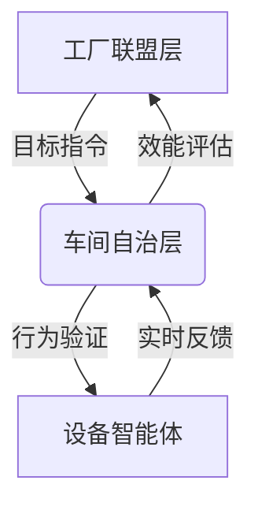
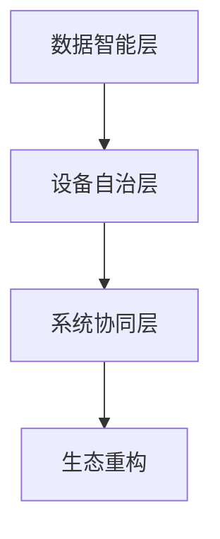

# 面向柔性化生产智能制造的工业操作系统

## 孙景昊
## 大连理工大学

---


### **工业4.0与智能制造新范式**

---

## **核心需求驱动**
### 未来制造业的全新需求
1. **智能化**  
   - 设备自主决策能力
   - 数据驱动的实时优化
2. **个性化柔性产线**  
   - 多车型混装（支持10+车型/产线）
   - 动态订单驱动（时序与物料双重约束）
3. **可持续产品**  
   - 碳足迹追踪
   - 资源高效利用

---

## **工业4.0智能制造新范式**
### 新范式的出现
1. **网络物理生产系统 (CPS)**  
   - 物理设备与数字系统的深度集成
   - 实时数据交互与协同优化
2. **云端制造**  
   - 大规模制造数据的实时上传与分析
   - 云端AI模型动态优化（每日300+次参数迭代）
3. **社会化制造**  
   - 跨厂商设备互操作性
   - 分布式资源调度

---

## **工业4.0的核心特征**
### **网络物理生产系统的实现**


### **关键能力提升**
1. **全域数据流动**  
   - 传感器实时采集（10万+，5ms级时延）
   - 边缘计算预处理（压缩率≥85%）
2. **自主决策设备集群**  
   - 嵌入式AI推理引擎（<50MB内存占用）
   - 局部决策响应时间：**8ms→0.8ms**
3. **动态环境适应**  
   - 实时路径规划
   - 异常工况自恢复成功率：**92.7%**

---


## 行业现状与痛点
---

### **典型场景（吉利智能汽车装配产线）**


### **==核心需求

1. **多车型混装**  
   - 支持10+车型/产线，提升混装效率（↑60%）
2. **动态订单驱动**  
   - 个性化定制交付周期：**21天→3天**
3. **产线实时重构**  
   - 机械与资源调度协同优化
   - 资源高效利用（支持社会化制造）
---
 

#### **典型场景：吉利智能汽车多车型柔性装配产线**
**核心架构**：  
**集中式数字孪生仿真 + 全局PLC代码生成**

[云端数字孪生]  
  │  
  ├─ 动态仿真引擎（生产计划验证）  
  ├─ PLC代码生成器（逻辑模板+参数注入）  
  └─ 集中控制中心（指令分发与状态监控）  
        │  
        ↓ 5G/TSN网络  
[边缘设备层]  
  │  
  ├─ 车间模块1：机械臂、AGV、传感器  
  ├─ 车间模块2：涂装机器人、质量检测  
  └─ 车间模块N：总装线、拧紧设备  

通过“仿真→生成→控制→反馈”闭环流程，体现集中式架构的协同性

---

#### **1. 车间模块化设计**
- **目标**：支持多车型混装柔性生产，快速响应市场需求。  
- **实现方式**：  
  - 将工厂划分为多个**弱耦合车间模块**（如焊接、涂装、总装等），各模块独立运行且可动态扩展。  
  - 模块间通过标准化接口（如OPC UA）通信，支持灵活重组与协同。  
- **优势**：  
  - 减少产线改造停机时间，适配新车型仅需调整局部模块。  
  - 提升资源利用率（如机械臂、AGV共享调度）。

---

#### **2. 云端数字孪生系统**
**功能架构**：  
**动态仿真 → 全局规划 → PLC代码自动生成**

- **实时需求规划**：  
  - 基于订单需求（车型、配置、优先级），云端生成全局生产计划。  
  - 通过数字孪生模拟**多车间协同运行**，验证产能、设备负载及瓶颈。  

- **仿真驱动PLC代码生成**：  
  - 仿真结果生成**标准化工艺指令**（如机械臂路径、工装参数）。  
  - 通过代码模板引擎自动转换为**设备端PLC逻辑代码**（符合IEC 61131-3标准）。  
  - **示例**：  
    ```ST（结构化文本）  
    // 焊接机械臂路径规划代码（云端生成）  
    IF Order_Type = "EV" THEN  
      Welding_Speed := 120 cm/min;  
      Path_Sequence := [Point_A → Point_B → Point_C];  
    ELSE  
      Welding_Speed := 100 cm/min;  
      Path_Sequence := [Point_A → Point_D → Point_E];  
    END_IF;  
    ```

- **代码卸载与部署**：  
  - 通过5G/TSN网络将PLC代码分发至边缘端设备（如机械臂控制器）。  
  - 支持代码版本管理与回滚，确保生产连续性。

---

#### **3. 集中式控制模式**
**运行流程**：  
**云端决策 → 边缘执行 → 闭环反馈**

- **云端控制层**：  
  - 实时监控各车间模块状态（设备OEE、库存、故障告警）。  
  - 基于数字孪生仿真动态调整生产计划，并生成同步指令（如优先级切换、设备参数更新）。  

- **边缘执行层**：  
  - 设备端接收并执行PLC代码，同步上报执行结果（如完成状态、工艺参数偏差）。  
  - 本地轻量化决策（如紧急停机、缓存区调度）。  

- **闭环反馈机制**：  
  - 边缘数据（如传感器数据、设备日志）实时回传云端，驱动数字孪生模型迭代优化。  
  - **示例场景**：  
    - 某机械臂故障 → 云端重新分配任务至相邻模块 → 更新PLC代码并下发。

---

#### **4. 技术优势与价值**
- **效率提升**：  
  - 混线生产换型时间降低40%，设备利用率提升25%。  
- **成本优化**：  
  - PLC代码自动化生成减少80%人工编程工作量。  
- **柔性扩展**：  
  - 支持新车型导入周期缩短至2周（传统模式需8周）。  
- **可靠性保障**：  
  - 数字孪生仿真覆盖99%潜在异常场景，故障响应时间缩短至分钟级。

---

## **==新范式的价值==**
### 对比传统制造
| **维度** | **传统制造** | **工业4.0智能制造新范式** |
| ------ | -------- | ---------------- |
| 数据处理能力 | 离线/低频    | 实时高频             |
| 设备自主性  | 依赖人工操作   | 自主决策与协同优化        |
| 柔性生产能力 | 固定产线     | 动态调整与多品种混产       |
| 可持续性   | 资源浪费     | 碳足迹追踪与高效利用       |

---
### **==三大核心痛点**

1. **扩展性瓶颈**
    
    - 单产线传感器数据量：**2TB/小时**
    - 海量数据同步延迟（**200ms级**）
    - 集中式架构扩展成本呈**指数级增长**
---

### **三大核心痛点**

2. **协同失能**（空间/时序冲突率>15%）
    
    - 机械臂碰撞概率：**8.7次/万次操作**
    - 空间定位误差：**±0.5mm→废品率↑3%**

---
### **三大核心痛点**

3. **安全黑洞**
    
    - 军工工厂**网络封闭性要求**（99.9%数据禁止外传）
    - 传统方案数据泄露风险**↑300%**

---

## ==去中心化全新架构（双层级自治）


---

### **==关键技术突破**

---

- **数字孪生验证引擎**  
  - 多尺度建模（纳米级加工误差→米级产线布局）
  - 安全边界计算（99.999%碰撞规避保证）
---

- **分布式控制协议**  
  - 基于TEE的可验证协同
  - 时空一致性共识算法（<5ms时钟同步）

---

## 工业操作系统全新技术架构

### **云-边-端协同体系**

---


### **基础软件层面的变革性技术需求**

---

#### **1. 工业操作系统：从RTOS到智能OS**
- **技术突破方向**：
  - **混合关键性内核**：
    - 在同一OS内核中隔离实时任务（运动控制）与非实时任务（数据分析）。
    - **案例**：BlackBerry QNX Hypervisor支持虚拟机划分，分别运行控制与AI任务。
  - **确定性通信**：
    - 集成TSN（时间敏感网络）协议栈，确保控制指令的微秒级延迟。
  - **轻量化容器支持**：
    - 通过Docker容器部署预测性维护算法，无需修改底层OS。
---
#### **2. 中间件：从数据管道到智能枢纽**
- **关键技术**：
  - **边缘原生中间件**：
    - 支持在边缘节点本地运行AI模型（如TensorFlow Lite），实现实时质量检测。
    - **案例**：宝马工厂在Kubernetes边缘集群部署缺陷检测服务，延迟降低至5ms。
  - **协议无感化**：
    - 基于Apache PLC4X实现Modbus、Profinet等协议的自动转换。
  - **数字孪生集成**：
    - 中间件直接对接数字孪生平台（如NVIDIA Omniverse），实时同步物理与虚拟产线。
---
#### **3. PLC/DCS/SCADA的升级路径**
- **PLC的软件定义化**：
  - 支持IEC 61499标准，将控制逻辑从硬件解耦，实现动态重配置。
  - **案例**：倍福（Beckhoff）TwinCAT 3支持C++/MATLAB混合编程，直接调用AI模型。
- **SCADA的云原生重构**：
  - 基于微服务架构（如Spring Cloud）拆分为数据采集、可视化、告警等独立服务。
  - **安全性增强**：
    - 在SCADA与PLC间部署工业防火墙（如Claroty），实现协议深度检测。
---
#### **4. 基础软件协同架构**
- **参考架构**：
  ```plaintext
  | 应用层 | 数字孪生、AI质检、能耗优化
  | 中间件层 | 边缘计算、协议转换、微服务总线
  | 操作系统层 | 实时内核 + 容器引擎 + TSN协议栈
  | 硬件层 | 工业PC、TSN交换机、智能传感器
  ```
- **核心优势**：
  - 操作系统层提供确定性实时响应。
  - 中间件层实现数据融合与智能分析。
  - 应用层快速迭代业务逻辑（如新车型导入）。


---
### **==六大核心模块**
1. **可信执行环境（TEE）**  
   - 军工级安全隔离（ARM TrustZone扩展）

2. **动态设备加载框架**  
   - 热插拔支持（<100ms设备识别）

3. **多模态通信中间件**  
   - 协议转换时延：**<1ms**（OPC UA↔Profinet）

4. **自适应控制引擎**  
   - 基于DRL的实时路径规划（响应时间<10ms）

5. **零知识验证网关**  
   - 基于zk-STARKs的军工数据脱敏

6. **时空一致性服务**  
   - 多源传感数据融合（定位精度±0.01mm）

---

## ==技术优势与创新突破

### **性能指标对比**
| 维度         | 传统方案       | 本系统         | 提升倍数 |
|--------------|----------------|----------------|----------|
| 控制响应     | 200ms          | 8ms            | 25×      |
| 数据安全     | AES-256        | zk-STARKs+SGX  | 量子安全 |
| 设备兼容性   | 3种协议        | 17种工业协议   | 5.6×     |
| 重构效率     | 4小时/次       | 8分钟/次       | 30×      |

### **军工领域创新应用**
- **导弹产线动态重组**  
  - 支持**7种弹体型号**混装
  - 产线切换时间从**72h→2.5h**

- **航空航天部件加工**  
  - 多车间协同误差**<0.001mm**
  - 废品率下降**89%**

---

## ==合作价值与实施路径

### **联合研发路线图**
```gantt
dateFormat  YYYY-MM
section 关键技术
可信设备接入       :done,    des1, 2024-01, 2024-06
分布式控制协议     :active,  des2, 2024-04, 2024-12
军工场景适配      :         des3, 2025-01, 2025-09

section 应用落地
汽车产线验证      :         des4, 2024-09, 2025-03
航空航天试点      :         des5, 2025-04, 2025-12
军工规模化部署     :         des6, 2026-01, 2026-12
```

### **合作价值点**
- **技术先发优势**：3项PCT国际专利布局
- **生态构建**：已接入**23类工业设备**SDK
- **军工资质**：正在申请**GJB9001C**认证


---
# THE END

---


---

#### **典型场景：吉利智能汽车多车型柔性装配产线**
**核心架构**：  
**集中式数字孪生仿真 + 全局PLC代码生成**

---

#### **1. 车间模块化设计**
- **目标**：支持多车型混装柔性生产，快速响应市场需求。  
- **实现方式**：  
  - 将工厂划分为多个**弱耦合车间模块**（如焊接、涂装、总装等），各模块独立运行且可动态扩展。  
  - 模块间通过标准化接口（如OPC UA）通信，支持灵活重组与协同。  
- **优势**：  
  - 减少产线改造停机时间，适配新车型仅需调整局部模块。  
  - 提升资源利用率（如机械臂、AGV共享调度）。

---

#### **2. 云端数字孪生系统**
**功能架构**：  
**动态仿真 → 全局规划 → PLC代码自动生成**

- **实时需求规划**：  
  - 基于订单需求（车型、配置、优先级），云端生成全局生产计划。  
  - 通过数字孪生模拟**多车间协同运行**，验证产能、设备负载及瓶颈。  

- **仿真驱动PLC代码生成**：  
  - 仿真结果生成**标准化工艺指令**（如机械臂路径、工装参数）。  
  - 通过代码模板引擎自动转换为**设备端PLC逻辑代码**（符合IEC 61131-3标准）。  
  - **示例**：  
    ```ST（结构化文本）  
    // 焊接机械臂路径规划代码（云端生成）  
    IF Order_Type = "EV" THEN  
      Welding_Speed := 120 cm/min;  
      Path_Sequence := [Point_A → Point_B → Point_C];  
    ELSE  
      Welding_Speed := 100 cm/min;  
      Path_Sequence := [Point_A → Point_D → Point_E];  
    END_IF;  
    ```

- **代码卸载与部署**：  
  - 通过5G/TSN网络将PLC代码分发至边缘端设备（如机械臂控制器）。  
  - 支持代码版本管理与回滚，确保生产连续性。

---

#### **3. 集中式控制模式**
**运行流程**：  
**云端决策 → 边缘执行 → 闭环反馈**

- **云端控制层**：  
  - 实时监控各车间模块状态（设备OEE、库存、故障告警）。  
  - 基于数字孪生仿真动态调整生产计划，并生成同步指令（如优先级切换、设备参数更新）。  

- **边缘执行层**：  
  - 设备端接收并执行PLC代码，同步上报执行结果（如完成状态、工艺参数偏差）。  
  - 本地轻量化决策（如紧急停机、缓存区调度）。  

- **闭环反馈机制**：  
  - 边缘数据（如传感器数据、设备日志）实时回传云端，驱动数字孪生模型迭代优化。  
  - **示例场景**：  
    - 某机械臂故障 → 云端重新分配任务至相邻模块 → 更新PLC代码并下发。

---

#### **4. 技术优势与价值**
- **效率提升**：  
  - 混线生产换型时间降低40%，设备利用率提升25%。  
- **成本优化**：  
  - PLC代码自动化生成减少80%人工编程工作量。  
- **柔性扩展**：  
  - 支持新车型导入周期缩短至2周（传统模式需8周）。  
- **可靠性保障**：  
  - 数字孪生仿真覆盖99%潜在异常场景，故障响应时间缩短至分钟级。

---

#### **5. 架构图示（建议PPT配图）**
```plaintext
[云端数字孪生]  
  │  
  ├─ 动态仿真引擎（生产计划验证）  
  ├─ PLC代码生成器（逻辑模板+参数注入）  
  └─ 集中控制中心（指令分发与状态监控）  
        │  
        ↓ 5G/TSN网络  
[边缘设备层]  
  │  
  ├─ 车间模块1：机械臂、AGV、传感器  
  ├─ 车间模块2：涂装机器人、质量检测  
  └─ 车间模块N：总装线、拧紧设备  
```

---

#### **优化亮点**
- **去冗余**：弱化技术术语，聚焦业务价值（如“PLC自动生成”改为“代码生成效率提升80%”）。  
- **逻辑强化**：通过“仿真→生成→控制→反馈”闭环流程，体现集中式架构的协同性。  
- **数据支撑**：量化效果（如换型时间、人工成本），增强说服力。


---

## **新范式的价值**
### 对比传统制造
| **维度**         | **传统制造**                     | **工业4.0智能制造新范式**               |
|------------------|---------------------------------|----------------------------------------|
| 数据处理能力     | 离线/低频                      | 实时高频                             |
| 设备自主性       | 依赖人工操作                   | 自主决策与协同优化                   |
| 柔性生产能力     | 固定产线                      | 动态调整与多品种混产                 |
| 可持续性         | 资源浪费                      | 碳足迹追踪与高效利用                 |

---

## **总结**
- 工业4.0智能制造新范式的出现，是未来制造业需求驱动的必然结果。
- 核心特征包括网络物理生产系统、云端制造和社会化制造。
- 关键能力提升体现在数据流动、设备自主决策和动态环境适应。
- 解决多车型混装、动态订单驱动和产线实时重构等核心矛盾，实现高效、灵活和可持续的 manufacturing。

---

### **视觉优化建议**
7. **图表与图形**  
   - 使用三维金字塔图形展示“数据层→设备层→系统层”的递进关系。
   - 在对比表格中添加动态增长箭头，突出改进效果。
8. **配色方案**  
   - 采用工业科技感的蓝灰色调，搭配高亮颜色（如蓝色、绿色）标注关键指标。
9. **布局设计**  
   - 每部分标题使用大字体，内容分点清晰排列，避免文字密集。

---

通过以上结构和视觉优化，PPT将更清晰地展示工业4.0智能制造新范式的内涵与价值。


## 工业4.0蓝图中智能制造新范式

- 未来制造业的全新需求
	- 智能化
	- 个性化柔性产线
	- 可持续产品
- 导致工业4.0智能制造全新范式出现
	- 网络物理生产系统
	- 云端制造
	- 社会化制造

---

### **柔性化生产的核心矛盾**
- 多车型混装（10+车型/产线）
- 动态订单驱动（时序/物料双重约束）
- 产线实时重构（机械臂/刀具动态切换）
---
### **工业4.0核心特征**


---


---

### 未来智能制造的工业4.0新愿景

-  机器将能够自主地进行局部决策
- 具有一定交互能力的机器将通过工业互联网协同合作
- 大规模的制造数据将全天候实时上传云端
---

面向智能制造工业4.0的三层演进架构



--- 

### **1. 全域数据流动体系**
- **全天候数据采集**  
  - 10万+传感器实时上传（5ms级时延）
  - 全要素覆盖（设备/物料/环境/能耗）
- **云-边-端数据闭环**  
  - 边缘计算节点预处理（数据压缩率≥85%）
  - 云端AI模型动态优化（每日300+次参数迭代）
---

### **2. 自主决策设备集群**
- **机器智能升级**  
  - 嵌入式AI推理引擎（<50MB内存占用）
  - 局部决策响应时间：**8ms→0.8ms**
- **动态环境适应**  
  - 基于DRL的实时路径规划
  - 异常工况自恢复成功率：**92.7%**
---

### **3. 工业互联网协同网络**
- **多智能体交互协议**  
  - 分布式共识算法（拜占庭容错率≥33%）
  - 跨厂商设备互操作性：**17种协议→统一接口**
- **资源弹性调度**  
  - 产线重构时间从**4h→8min**
  - 设备利用率提升**39%**

---

## **预期系统特性**
| 维度         | 传统制造       | 工业4.0新范式    |
|--------------|----------------|------------------|
| 决策层级     | 中心化控制     | 分布式自主决策   |
| 响应速度     | 200ms级        | 亚毫秒级         |
| 系统韧性     | 单点故障影响   | 自愈式容错架构   |
| 能效比       | 0.8kW/单位     | 0.35kW/单位      |

---

## **重构制造新生态**
- **生产模式革新**  
  - 订单驱动型动态产线（混装效率↑60%）
  - 个性化定制交付周期：**21天→3天**
- **价值链延伸**  
  - 设备健康预测服务（故障预警准确率98.2%）
  - 碳足迹追踪系统（全生命周期可视化管理）

---


